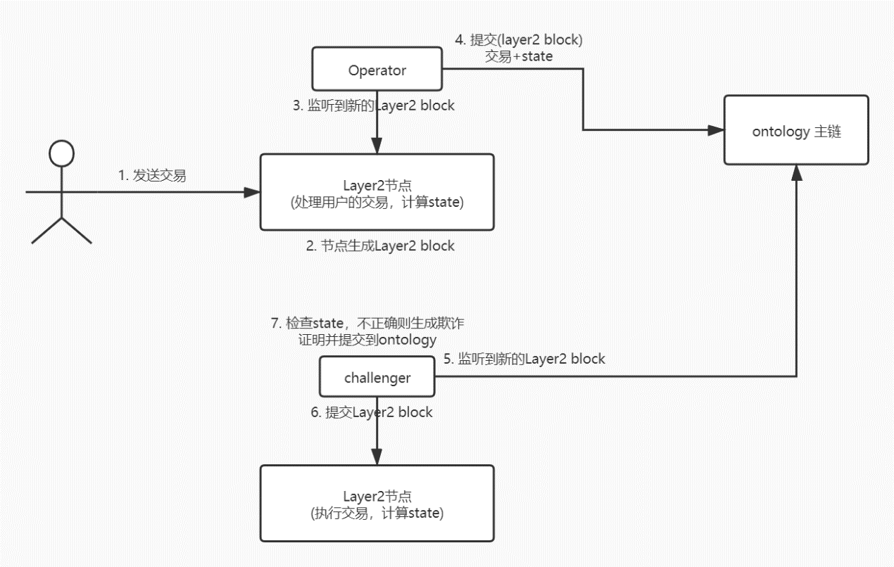
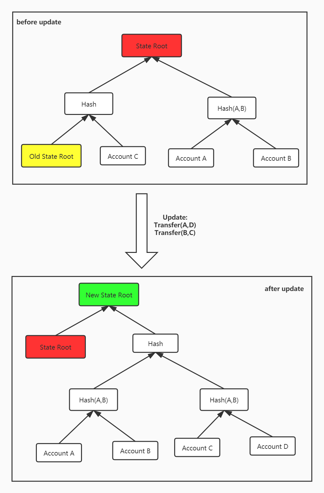

# Ontology Layer2 Node

English|[中文](design_CN.md)

## 名称解释

### Layer2交易

用户进行转账或者执行合约的请求，用户已经对其签名。这个交易可以和ontology主链的交易格式一样，也可以不一样。

### Collector

交易收集者，负责收集用户的Layer2交易，可以有多个collector，用户可以将自己的Layer2交易广播给多个collector。

### Layer2区块

Collector周期性的打包收集到的Layer2交易，运行交易，这样就有了新的State。Collector负责将新State的Root提交到Ontology主链。

### Layer2区块State

在执行Layer2区块中打包的交易后，新State的Root为该Layer2区块State。

### Challenger

负责验证Collector提交到ontology主链的Layer2区块State。这要求Challenger从Collector同步Layer2区块，维护完整的全局状态。

### SMT

稀疏merkel树

### 账户状态证明

包括账户状态信息以及其merkel证明，可以从Collector和Challenger查询来获取。只有他们维护有完整的全局状态。

## 工作流程

###	Deposit到Layer2

1.	用户在ontology主链进行Deposit操作，主链合约锁定用户deposit的资金，记录这笔资金在Layer2的状态，此时状态为“未释放”。

2.	Collector查询到主链ontology上有deposit操作，collector会在Layer2根据deposit的操作修改其State，Collector增加一个deposit释放交易，并和收集的其他用户交易一起打包到Layer2区块，提交这个Layer2区块State到ontology主链时，会附带提交deposit已经释放的请求。

3.	主链合约执行deposit释放操作，修改deposit资金状态为“已释放”。

### Withdraw到ontology

1.	用户构造Withdraw的Layer2交易并提交给Collector。

2.	Collector根据Withdraw修改其State，同时打包该Withdraw交易以及其他用户交易一起到一个Layer2区块，提交这个Layer2区块State到ontology主链时，会附带提交withdraw请求。

3.	主链合约执行Withdraw请求，记录一笔withdraw资金记录，并设置状态为“未释放”。

4.	在State确认后，用户提交withdraw释放请求。

5.	主链合约执行withdraw释放请求，给目标账户转账，同时设置withdraw记录为“已释放“

###	Layer2交易

1.	用户构造Transfer的Layer2交易并提交给Collector。

2.	Collector打包该transfer交易以及其他交易到一个Layer2区块，执行区块中的交易，提交这个Layer2区块State到ontology主链。

3.	等待State确认。

### 工作流程

###	合约部署

1.	用户提交合约以及合约部署的Layer2交易到Collector。

2.	Collector部署合约并打包该交易到Layer2区块

3.	Layer2区块同步到Challenger后，Challenger部署合约。

###	合约交易

1.	用户构造合约的Layer2交易并提交给Collector。

2.	Collector执行合约交易，生成新的state，打包该交易以及其他交易到一个Layer2区块，提交这个Layer2区块State到ontology主链。

3.	等待State确认

## 安全模型

### 区块State验证

Collector提交Layer2区块State到主链时，这个State是没有验证的，这个State其实是不安全的，我们通过Challenger角色来解决这个问题，Collector将Layer2区块同步给Challenger，Challenger执行Layer2区块中的交易，验证Layer2区块State。

这要求Collector必须将Layer2区块同步给Challenger。
Collector和Challenger联合是可以作恶的。
需要一个State的确认周期。

为防止Collector作恶，我们需要欺诈证明，欺诈证明包括上一个状态的SMT，Layer2区块，在合约中验证欺诈证明时，需要合约验证Layer2区块中交易，区块，执行Layer2交易（此处不包括合约交易，因为合约交易还依赖其上一个状态，合约交易问题在后面详述）来计算新的state。(如何验证区块，我们还需要在ontology主链上提交Laery区块的Hash)

以上欺诈证明有一个前提是要求collector同步Layer2区块给Challenger。

对于Challenger，有欺诈证明Collector作恶，Challenger需要向ontology主链提交欺诈证明和保证金来挑战，提交保证金的目的是防止恶意挑战。对于成功证明Collector作恶的Challenger，Challenger可以获取奖励，作恶的Collector将收到惩罚。（这要求collector在主链有抵押资产）

## 账户模型

账户使用Merkel树的方式来组织，但这是一个可以跟踪更新的Merkel树。Merkel树包含了更新之前的Root Hash和更新的账户.

每个State Root都固定对应一个高度，从0开始从下往上一次递增。我们需要在链上记录每个高度上的State Root。

如何证明一个账户的状态？

如果账户在高度为H时账户状态有更新，那么在高度为H的state树中包含有其账户状态，这是一个merkel树，从全局看又是一个子树。但我们在链上有这个子树的root hash，这样可以在这个子树上生成merkel proof，结合这个子树的root hash可以证明这个账户的状态。

但这个账户可能不是最新的，因为后续的更新产生的新的merkel树中包含了更新的账户状态。所以有挑战机制，挑战者只需要提交这个账户的merkel proof，其root hash所在的高度更高，那么其挑战成功。

为什么要这种merkel树？

在链上只有每个高度的state root，有时候需要链上验证state变更的有效性。状态转换可以写成如下形式：

S = F（S‘，Txs）

其中S‘是上一个状态，Txs是交易，S为执行Txs后生成的新状态。

最简单的链上验证状态转换方式是提交全局状态S‘和Txs，根据链上的S’的state root来验证全局状态S‘，在这个全局状态下执行Txs，生成一个新的全局状态S，根据链上S的state root来验证状态转换有效性。

但这个方式有许多问题：

1.	全局状态往往很大，无论数据量大小还是在这个全局状态下执行交易，都有很大的限制要求。

Txs往往不会影响到全局所有状态，只是其中很小部分，只有很小部分状态有更新，以上账户模型只跟踪状态的更新，这里有一个新的实现方式。

不提交全局状态的S‘，仅仅提交S’中会被Txs更新的局部状态以及其merkel proof，在上面已经介绍过如何证明这个状态。在局部状态下执行Txs，生成更新的局部状态，再加上S‘的state root可以计算新的S的state root，从而验证状态转换的有效性。

有哪些好处：
1.	无论状态有多少，但只要每次更新的状态不大，那么其子树很小，其merkel proof也比较小

2.	验证状态转换代价小，效率高，只需要提交较少的有更新需求的状态以及其很小的merkel proof，就可以验证状态转换的有效性。

3.	可以证明一个状态更新过程
