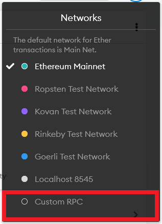

# Ontology EVM Contracts

This doc aims at guiding developers to develop, deploy and test EVM smart contracts on Ontology.

Now the Ontology network is compatible with Ethereum through Ontology EVM, meaning that Ontology supports EVM contracts and Web3 JSON-RPC protocol. It's possible to use EVM tools like Truffle, Remix and Web3.js directly on Ontology.


* [1 Development Environment and Tools](#1-development-environment-and-tools)
  * [1.1 Remix](#11-remix)
    * [1.1.1 Initialize Remix](#111-initialize-remix)
    * [1.1.2 Compile Contract](#112-compile-contract)
    * [1.1.3 Deploy Contract](#113-deploy-contract)
    * [1.1.4 Invoke Contract](#114-invoke-contract)
  * [1.2 Truffle](#12-truffle)
    * [1.2.1  Install Truffle](#121-install-truffle)
    * [1.2.2 Configure truffle-config](#122-configure-truffle-config)
    * [1.2.3 Deploy Contract](#123-deploy-contract)
  * [1.3 Hardhat](#13-hardhat)
    * [1.3.1 Install Hardhat](#131-install-hardhat)
    * [1.3.2 Configure hardhat-config](#132-configure-hardhat-config)
    * [1.3.3 Deploy Contract](#133-deploy-contract)
* [2 Network Info](#2-network-info)
    * [2.1 Network Types](#21-network-types)
    * [2.2 EVM Assets on Ontology](#22-evm-assets-on-ontology)
    * [2.3 OEP-4 Assets](#23-oep-4-assets)
    * [2.4 Gas-Fee](#24-gas-fee)
* [3 Key Management with MetaMask](#3-key-management-with-metamask)
    * [3.1 Initialize Web3](#31-initialize-web3)
    * [3.2 Set up Account](#32-set-up-account)
    * [3.3 Initialize Contract](#33-initialize-contract)
    * [3.4 Call Functions](#34-Call-Functions)
* [4 Move Assets from Ethereum to Ontology](#4-move-assets-from-ethereum-to-ontology)
* [5 Contract Development](#5-contract-development)
  * [5.1 Set up Environment](#51-set-up-environment)
  * [5.2 Contract Design](#52-contract-design)
    * [5.2.1 Contract Logic](#521-contract-logic)
    * [5.2.2 Define Contract Event](#522-define-contract-event)
    * [5.2.3 Define Function](#523-define-function)
  * [5.3 Compile and Test Contract using Hardhat ](#53-compile-and-test-contract-using-hardhat )
    * [5.3.1 Create a Hardhat Project](#531-create-a-hardhat-project)
    * [5.3.2 Configure hardhat.config](#532-configure-hardhat.config)
    * [5.3.3 File Preparation](#533-file-preparation)
    * [5.3.4 Include Code in the `test` Folder](#534-include-code-in-the-folder)
    * [5.3.5 Compile Contract](#535-compile-contract)
    * [5.3.6 Test Contract](#536-test-contract)
* [6 API Reference](#6-api-reference)

## 1 Development Environment and Tools

EVM smart contracts are written using [Solidity](https://docs.soliditylang.org/en/v0.8.6/). You can reuse existing Ethereum contract frameworks to develop and deploy EVM contracts. 

### 1.1 Remix

[Remix IDE](https://remix.ethereum.org/#optimize=false&runs=200&evmVersion=null&version=soljson-v0.8.1+commit.df193b15.js) is an open source development environment for EVM contracts. Remix IDE documentation is [here](https://remix-ide.readthedocs.io/en/latest/)。

We will now go through an example of a Hello World contract development using Remix.

#### 1.1.1 Initialize Remix

First, locate and activate "Solidity Compiler" and "Deploy and Run Transactions" in PLUGIN MANAGER.


Then, select Solidity environment. Create a new file and name it HelloWorld.sol. Then copy the code of [Hello World contract](../contract-demo/helloworlddemo/helloworld.sol) and paste it in the file just created.


#### 1.1.2 Compile Contract

Click on the Solidity Compiler button, select compiler version to 0.5.10 and start compiling HelloWorld.sol.

#### 1.1.3 Deploy Contract

The contract is ready to deploy on Ontology after compiling. Here we deploy it on Ontology testnet.

> **Notice: ** MetaMask must have been set up on Ontology before you deploy the contract.

Select "Custom RPC" in MetaMask networks settings. Fill in and save the info below.
- Network name: ontology testnet
- Node url："http://polaris1.ont.io:20339" or "http://polaris2.ont.io:20339" or "http://polaris3.ont.io:20339"
- Chain ID：5851
- Blockchain explorer url："https://explorer.ont.io/testnet"



Next, apply for testnet ONG at Ontology [Faucet address](https://developer.ont.io/) as gas fee.

Finally, select "Injected Web3" in Remix. Click "Deploy" to finish.


#### 1.1.4 Invoke Contract

Now you can call the method in this contract. The string `hello` is saved in the contract when you deploy it, you can call the method `message` to query this string:


### 1.2 Truffle

Truffle offers tools and frameworks for EVM contract development, testing and management. You can find more details [here](https://www.trufflesuite.com/docs/truffle/quickstart).

Now we will demonstrate how to use Truffle with this [test code](../contract-demo/truffledemo).

#### 1.2.1 Install Truffle

First, initialize and install dependencies.

- [Node.js v8+ LTS and npm](https://nodejs.org/en/) (comes with Node)
- [Git](https://git-scm.com/)

Then run this command to install Truffle.

```shell
npm install -g truffle
```

#### 1.2.2 Configure truffle-config

- Create a new `.secret` to store the mnemonic phrase or private key (which can be found in MetaMask).
- Edit the code of truffle-config as below.

```
const HDWalletProvider = require('@truffle/hdwallet-provider');
const fs = require('fs');
const mnemonic = fs.readFileSync(".secret").toString().trim();
module.exports = {
  networks: {
    ontology: {
     provider: () => new HDWalletProvider(mnemonic, `http://polaris2.ont.io:20339`),
     network_id: 5851,
     port: 20339,            // Standard Ethereum port (default: none)
     timeoutBlocks: 200,
     gas:800000,
     skipDryRun: true
    }
  },
  compilers: {
    solc: {
      version: "0.5.16",    // Fetch exact version from solc-bin (default: truffle's version)
      docker: false,        // Use "0.5.1" you've installed locally with docker (default: false)
      settings: {          // See the solidity docs for advice about optimization and evmVersion
       optimizer: {
         enabled: true,
         runs: 200
       },
       evmVersion: "byzantium"
      }
    }
  }
};
```

#### 1.2.3 Deploy Contract

Run this command to deploy the contract on the Ontology network.

```
truffle migrate --network ontology
```

If successful, you will see the result below.

> **Notice:** Avoid using ETH units (e.g. wei, gwei, ether, etc.) when writing test scripts.

```
Compiling your contracts...
===========================
> Everything is up to date, there is nothing to compile.

Starting migrations...
======================
> Network name:    'ontology'
> Network id:      12345
> Block gas limit: 0 (0x0)
1_initial_migration.js
======================

   Replacing 'Migrations'
   ----------------------
   > transaction hash:    0x9019551f3d60611e1bc6b323f3cf3020d15c8aeb06833d14ff864e24622884aa
   > Blocks: 0            Seconds: 4
   > contract address:    0x53e137A51CfD1E1b088E0d921eB5dBCF9cFa955E
   > block number:        6264
   > block timestamp:     1624876467
   > account:             0x4e7946D1Ee8f8703E24C6F3fBf032AD4459c4648
   > balance:             0.00001
   > gas used:            172969 (0x2a3a9)
   > gas price:           0 gwei
   > value sent:          0 ETH
   > total cost:          0 ETH


   > Saving migration to chain.
   > Saving artifacts
   -------------------------------------
   > Total cost:                   0 ETH


2_deploy_migration.js
=====================

   Replacing 'HelloWorld'
   ----------------------
   > transaction hash:    0xf8289b96f2496a8c940ca38d736a554a90f64d927b689921781619499906721b
   > Blocks: 0            Seconds: 4
   > contract address:    0xfbff9bd546B0e0D4b40f6f758847b70050d01b37
   > block number:        6266
   > block timestamp:     1624876479
   > account:             0x4e7946D1Ee8f8703E24C6F3fBf032AD4459c4648
   > balance:             0.00001
   > gas used:            243703 (0x3b7f7)
   > gas price:           0 gwei
   > value sent:          0 ETH
   > total cost:          0 ETH

hello contract address: 0xfbff9bd546B0e0D4b40f6f758847b70050d01b37

   > Saving migration to chain.
   > Saving artifacts
   -------------------------------------
   > Total cost:                   0 ETH


Summary
=======
> Total deployments:   2
> Final cost:          0 ETH
```

### 1.3 Hardhat

Hardhat is an Ethereum development environment. We will use this [test code](../contract-demo/hardhatdemo) as an example and demonstrate how to use Hardhat.

#### 1.3.1 Install Hardhat

Please refer to [Hardhat doc](https://hardhat.org/getting-started/) for details on this step.

#### 1.3.2 Configure hardhat-config

- Create a new `.secret` file to save your private key.
- Update the code of hardhat.config.js as shown below:

```
require("@nomiclabs/hardhat-waffle");
const fs = require('fs');
const privateKey = fs.readFileSync(".secret").toString().trim();

module.exports = {
    defaultNetwork: "ontology_testnet",
    networks: {
        hardhat: {},
        ontology_testnet: {
            url: "http://polaris2.ont.io:20339",
            chainId: 5851,
            gasPrice:2500,
            gas:2000000,
            timeout:10000000,
            accounts: [privateKey]
        }
    },
    solidity: {
        version: "0.8.0",
        settings: {
            optimizer: {
                enabled: true,
                runs: 200
            }
        }
    },
};
```

#### 1.3.3 Deploy Contract 

Run this command in root of the project directory to deploy the contract on Ontology Chain: 

```
$ npx hardhat run scripts/sample-script.js --network ontology_testnet
```

The result looks like this:

```
sss@sss hardhatdemo % npx hardhat run scripts/sample-script.js --network ontology_testnet
RedPacket deployed to: 0xB105388ac7F019557132eD6eA90fB4BAaFde6E81
```

## 2 Network Info

### 2.1 Network Types

#### Mainnet

| Item           | Description                                                                                                             |
| :------------- | :---------------------------------------------------------------------------------------------------------------------- |
| NetworkName    | Ontology Mainnet                                                                                                        |
| chainId        | 58                                                                                                                      |
| Gas Token      | ONG Token                                                                                                               |
| RPC            | http://dappnode1.ont.io:20339,http://dappnode2.ont.io:20339,http://dappnode3.ont.io:20339,http://dappnode4.ont.io:20339 |
| Block Explorer | https://explorer.ont.io/                                                                                                |

#### Testnet

| Item           | Description                                                                                                           |
| :------------- | :-------------------------------------------------------------------------------------------------------------------- |
| NetworkName    | Ontology Testnet                                                                                                      |
| chainId        | 5851                                                                                                                  |
| Gas Token      | ONG Token                                                                                                             |
| RPC            | http://polaris1.ont.io:20339, http://polaris2.ont.io:20339, http://polaris3.ont.io:20339,http://polaris4.ont.io:20339 |
| Block Explorer | https://explorer.ont.io/testnet                                                                                       |

### 2.2 EVM Assets on Ontology

| Name | Address                                     |
| :--- | :------------------------------------------ |
| ONG  | 0x00000000000000000000000000000000000000000 |

### 2.3 OEP-4 Assets

Please refer to this [link](https://explorer.ont.io/tokens/oep4/10/1#).

### 2.4 Gas Fee

Ontology EVM contracts consume ONG as gas fee for execution. You can apply for testnet ONG [here](https://developer.ont.io/).

## 3 Key Management with MetaMask 

Ontology allows developers to manage Ethereum wallet private keys using MetaMask browser add-on. 

MetaMask is a non-custodial wallet. tTe user's private key is encoded with the mnemonic phrase and stored in user's local browser. Once lost, the user can no longer control the savings or restore access to the wallet. MetaMask communicates with Ethereum Ledger via Infura. Please refer to the [MetaMask website](https://metamask.io/) for more details.

### 3.1 Initialize Web3

First, install the following in your DApp:

   ```
   npm install --save web3
   ```

Create a new file, name it web3.js and insert the following code in it:

   ```js
   import Web3 from 'web3';

const getWeb3 = () => new Promise((resolve) => {
    window.addEventListener('load', () => {
        let currentWeb3;

        if (window.ethereum) {
            currentWeb3 = new Web3(window.ethereum);
            try {
                // Request account access if needed
                window.ethereum.enable();
                // Accounts now exposed
                resolve(currentWeb3);
            } catch (error) {
                // User denied account access...
                alert('Please allow access for the app to work');
            }
        } else if (window.web3) {
            window.web3 = new Web3(web3.currentProvider);
            // Accounts always exposed
            resolve(currentWeb3);
        } else {
            console.log('Non-Ethereum browser detected. You should consider trying MetaMask!');
        }
    });
});

export default getWeb3;
   ```

To put it simply, you can inject the global object `ethereum` if you have added MetaMask to Chrome.

Next, import the code as below:

   ```js
   import getWeb3 from '/path/to/web3';
   ```

Call the function:

   ```js
     getWeb3()
    .then((result) => {
        this.web3 = result;// we instantiate our contract next
    });
   ```

### 3.2 Set up Account 

We need an account from the web3 instance we created above to send transactions.

   ```js
     this.web3.eth.getAccounts()
    .then((accounts) => {
        this.account = accounts[0];
    })
   ```

The `getAccounts()` function returns all the user’s Metamask accounts, while`accounts[0]` is the one currently selected by the user.

### 3.3 Initialize Contract

Initialize your contract after completing above steps. 

### 3.4 Call Functions

Now you can call any function by directly interacting with the instantiated contract. Please note that:

Functions that do not alter the state of the contract are `call()` functions. Below is an example of calling a `call()` function: 

```js
  this.myContractInstance.methods.myMethod(myParams)
    .call()
    .then(
        // do stuff with returned values
    )
```

Functions that alter the state of the contract are `send()` functions. Below is an example of calling a `send()` function: 

```
this.myContractInstance.methods.myMethod(myParams)
.send({
from: this.account,gasPrice: 0
}).then (
(receipt) => {
  // returns a transaction receipt}
);
```

## 4 Move Assets from Ethereum to Ontology

Ontology supports developers to conduct cross-chain asset transfer using [PolyBridge](https://bridge.poly.network/).

## 5 Contract Development

Now we will demonstrate the full process of contract development, deployment and testing using Hardhat. 

### 5.1 Set up Environment 

- Install [nodejs](https://nodejs.org/en/) 

- Install [Hardhat](https://hardhat.org/getting-started/)

### 5.2 Contract Design 

#### 5.2.1 Contract Logic

The contract we use as an example here is for sending red packets, which is used when users send crypto assets as gifts. The core functions are:

- Send red packets
- Receive red packets

Before sending red packets, the user need to determine the amount of tokens to be sent and the number of red packets. For instance, 100 tokens will be sent in 10 red packets (to 10 different wallets). For ease of understanding, each red packet contains the same amount, meaning that each contains 10 tokens.

Consequently, we define the data structure:

```
EIP20Interface public token; // support token address
uint public nextPacketId; // the next redpacket ID

// packetId -> Packet, store all the redpacket
mapping(uint => Packet) public packets;

//packetId -> address -> bool,  store receive redpacket record
mapping(uint => mapping(address => bool)) public receiveRecords;

struct Packet {
    uint[] assetAmounts;// Number of tokens per copy
    uint receivedIndex; // Number of red packets received
}
```

#### 5.2.2 Define Contract Event

When executing the contract, we can trace the process by adding events.

Here we design two events:

1. When the user send a red packet, the contract generates an ID for the red packets, which will be sent through this event notification:
```
event SendRedPacket(uint packetId, uint amount); 
```
2. When a user receives a red packet, this event notification is sent to record the ID and token amount of the received red packet:

```
event ReceiveRedPacket(uint packetId, uint amount);
```

#### 5.2.3 Define Function

**`sendRedPacket`** 

Sends red packets. Any system is able to call the function and send certain amount of tokens to the contract address. Other addresses can receive red packets from this contract address.

> **Notice:** Before invoking this function, the contract has to be authorized to transfer tokens from users' addresses. To do so, call the `approve` method of the token first.

```
function sendRedPacket(uint amount, uint packetNum) public payable returns (uint) {
    require(amount >= packetNum, "amount >= packetNum");
    require(packetNum > 0 && packetNum < 100, "packetNum>0 && packetNum < 100");
    uint before = token.universalBalanceOf(address(this));
    token.universalTransferFrom(address(msg.sender), address(this), amount);
    uint afterValue = token.universalBalanceOf(address(this));
    uint delta = afterValue - before;
    uint id = nextPacketId;
    uint[] memory assetAmounts = new uint[](packetNum);
    for (uint i = 0; i < packetNum; i++) {
        assetAmounts[i] = delta / packetNum;
    }
    packets[id] = Packet({assetAmounts : assetAmounts, receivedIndex : 0});
    nextPacketId = id + 1;
    emit SendRedPacket(id, amount);
    return id;
}
```

**`receivePacket`** 

Receives red packets. Any address can call this function by red packet ID to receive a red packet, meaning that you need to specify which one to receive. 

```
function receivePacket(uint packetId) public payable returns (bool) {
    require(packetId < nextPacketId, "not the redpacket");
    Packet memory p = packets[packetId];
    if (p.assetAmounts.length < 1) {
        return false;
    }
    require(p.receivedIndex < p.assetAmounts.length - 1, "It's over");
    require(receiveRecords[packetId][address(msg.sender)] == false, "has received");
    p.receivedIndex = p.receivedIndex + 1;
    bool res = token.universalTransfer(msg.sender, p.assetAmounts[p.receivedIndex]);
    require(res, "token transfer failed");
    packets[packetId] = p;
    receiveRecords[packetId][address(msg.sender)] == true;
    emit ReceiveRedPacket(packetId, p.assetAmounts[p.receivedIndex]);
    return true;
}
```
View the full code [here](../contract-demo/hardhatdemo/contracts/Redpacket.sol)。

### 5.3 Compile and Test Contract using Hardhat 

#### 5.3.1 Create a Hardhat Project 

```
mkdir hardhatdemo
cd hardhatdemo
npm init
npm install --save-dev hardhat
npx hardhat
```

#### 5.3.2 Configure hardhat.config

Include testnet node information:

```
module.exports = {
    defaultNetwork: "ontology_testnet",
    networks: {
        hardhat: {},
        ontology_testnet: {
            url: "http://polaris2.ont.io:20339",
            chainId: 5851,
            gasPrice:500,
            gas:2000000,
            timeout:10000000,
            accounts: ["your private key1","your private key2"]
        }
    },
    solidity: {
        version: "0.8.0",
        settings: {
            optimizer: {
                enabled: true,
                runs: 200
            }
        }
    },
};
```

`accounts` field takes the array of selected private key. There should be enough ONG balance in the corresponding address to pay for transactions. Apply Testnet ONG [here](https://developer.ont.io/).

#### 5.3.3 File Preparation

Add the contract file in the `contracts` folder. To support ERC-20 token transfer, we also need `EIP20Interface.sol`, `UniversalERC20.sol`, and `TokenDemo.sol` which you can download from [here](../contract-demo/hardhatdemo/contracts).

#### 5.3.4 Include Code in the `test` Folder 

```
describe("RedPacket", function () {
    let tokenDemo, redPacket, owner, acct1, assetAmount, packetAmount;
    beforeEach(async function () {
        const TokenDemo = await ethers.getContractFactory("TokenDemo");
        tokenDemo = await TokenDemo.deploy(10000000, "L Token", 18, "LT");
        await tokenDemo.deployed();
        const RedPacket = await ethers.getContractFactory("RedPacket");
        redPacket = await RedPacket.deploy(tokenDemo.address);
        await redPacket.deployed();
        [owner, acct1] = await ethers.getSigners();
        assetAmount = 1000;
        packetAmount = 10;
    });
    it("token", async function () {
        expect(await redPacket.token()).to.equal(tokenDemo.address);
    });
    it("sendRedPacket", async function () {
        const approveTx = await tokenDemo.approve(redPacket.address, assetAmount);
        await approveTx.wait();

        const sendRedPacketTx = await redPacket.sendRedPacket(assetAmount, packetAmount);
        await sendRedPacketTx.wait();
        let balance = await tokenDemo.balanceOf(redPacket.address);
        expect(balance.toString()).to.equal(assetAmount.toString());

        res = await redPacket.nextPacketId();
        expect(res.toString()).to.equal("1");

        await redPacket.connect(acct1).receivePacket(0);
        balance = await tokenDemo.balanceOf(acct1.address);
        expect(balance.toString()).to.equal((assetAmount / packetAmount).toString());
    });
});
```

#### 5.3.5 Compile Contract

Run this command in the root directory to compile the contract.

```
$ npx hardhat compile
Compiling 5 files with 0.8.0
Compilation finished successfully
```

Then the following folders are generated.

```
.
├── artifacts
├── cache
├── contracts
├── hardhat.config.js
├── node_modules
├── package-lock.json
├── package.json
├── scripts
└── test
```

#### 5.3.6 Test Contract

```
npx hardhat test
```

You will get the following result:

```
sss@sss hardhatdemo % npx hardhat test
  RedPacket
    ✓ token
    ✓ sendRedPacket (16159ms)


  2 passing (41s)
```

## 6 API Reference

Since data structure of an transaction on Ontology are different from those on Ethereum, Ontology only supports the following methods:


### Method List

| Method Name                                                                         | Description                                                                                                 |
| ----------------------------------------------------------------------------------- | ----------------------------------------------------------------------------------------------------------- |
| [net_version](#net_version)                                                       | Returns the current network ID                                                                              |
| [eth_chainId](#eth_chainid)                                                        | Returns the current chainId                                                                                 |
| [eth_blockNumber](#eth_blocknumber)                                                 | Returns the number of most recent block                                                                     |
| [eth_getBalance](#eth_getbalance)                                                   | Returns the balance of the account of given address                                                         |
| [eth_protocolVersion](#eth_protocolversion)                                        | Returns the current ethereum protocol version                                                               |
| [eth_syncing](#eth_syncing)                                                         | Returns data about the sync status                                                                          |
| [eth_gasPrice](#eth_gasprice)                                                       | Returns the current price per gas in wei                                                                    |
| [eth_getStorageAt](#eth_getstorageat)                                               | Returns the value from a storage position at a given address                                                |
| [eth_getTransactionCount](#eth_gettransactioncount)                                 | Returns the number of transactions sent from an address using Ontology EVM                                  |
| [eth_getBlockTransactionCountByHash](#eth_getblocktransactioncountbyhash)           | Returns the number of transactions using Ontology EVM in a block from a block matching the given block hash |
| [eth_getBlockTransactionCountByNumber](#eth_getblocktransactioncountbynumber)       | Returns the number of transactions in a block matching the given block number                               |
| [eth_getCode](#eth_getcode)                                                         | Returns code at a given address                                                                             |
| [eth_getTransactionLogs](#eth_gettransactionLogs)                                   | Returns transaction logs by a transaction hash                                                              |
| [eth_sendRawTransaction](#eth_sendrawtransaction)                                   | Creates new message call transaction or a contract creation for signed transactions                         |
| [eth_call](#eth_call)                                                               | Executes a new message call immediately without creating a transaction on the blockchain                    |
| [eth_estimateGas](#eth_estimategas)                                                 | Generates and returns an estimate of gas                                                                    |
| [eth_getBlockByNumber](#eth_getblockbynumber)                                       | Returns information about a block by block number                                                           |
| [eth_getBlockByHash](#eth_getblockbyhash)                                           | Returns information about a block by hash                                                                   |
| [eth_getTransactionByHash](#eth_gettransactionbyhash)                               | Returns information about a transaction by block hash                                                       |
| [eth_getTransactionByBlockHashAndIndex](#eth_gettransactionbyblockhashandindex)     | Returns information about a transaction by block hash and transaction index position                        |
| [eth_getTransactionByBlockNumberAndIndex](#eth_gettransactionbyBlocknumberandindex) | Returns information about a transaction by block number and transaction index position                      |
| [eth_getTransactionReceipt](#eth_gettransactionreceipt)                             | Returns the receipt of a transaction by transaction hash                                                    |
| [eth_pendingTransactions](#eth_pendingtransactions)                                 | Access all pending transactions                                                                             |
| [eth_pendingTransactionsByHash](#eth_pendingtransactionsbyhash)                     | Access all pending transactions by transaction hash                                                         |

### net_version

Returns the current network ID.

#### Parameters

None

#### Returns

`String`- The current network ID
- "58" - Ontology Mainnet
- "5851" - Ontology Polaris Testnet
- "12345" - solo node


#### Request Example

```shell
curl -X POST http://127.0.0.1:20339 -H 'Content-Type: application/json' --data '{"jsonrpc":"2.0","method":"net_version","params":[],"id":3}'
```

#### Response Example

```json
{
  "id": 3,
  "jsonrpc": "2.0",
  "result": "12345"
}
```

### eth_chainId

Returns the current chainId.

#### Parameters

None

#### Returns

`String` - the current chainId
- "58" - Ontology Mainnet
- "5851" - Ontology Polaris Testnet
- "12345" - solo node

#### Request Example

```shell
curl -X POST http://127.0.0.1:20339 -H 'Content-Type: application/json' --data '{"jsonrpc":"2.0","method":"eth_chainId","params":[],"id":67}'
```

#### Response Example

```json
{
  "jsonrpc": "2.0",
  "id": 67,
  "result": "0x3a"
}
```

### eth_blockNumber

Returns the number of most recent block.

#### Parameters

None

#### Returns

`QUANTITY` - integer of the current block number the client is on

#### Request Example

```shell
curl -X POST http://127.0.0.1:20339 -H 'Content-Type: application/json' --data '{"jsonrpc":"2.0","method":"eth_blockNumber","params":[],"id":83}'
```

#### Response Example

```json
{
  "id":83,
  "jsonrpc": "2.0",
  "result": "0x4b7" // 1207
}
```

### eth_getBalance

Returns the balance of the account of given address.

#### Parameters
1. `DATA`, 20 Bytes - address to check for balance.
2. `QUANTITY|TAG` - integer block number, or the string `"latest"`, `"earliest"` or `"pending"`

```
params: [
   '0x407d73d8a49eeb85d32cf465507dd71d507100c1',
   'latest'
]
```

#### Returns
`QUANTITY`- integer of the current balance in wei.

#### Request Example

```shell
curl -X POST http://127.0.0.1:20339 -H 'Content-Type: application/json' --data '{"jsonrpc":"2.0","method":"eth_getBalance","params":["0x407d73d8a49eeb85d32cf465507dd71d507100c1", "latest"],"id":1}'
```

#### Response Example

```json
{
  "id":1,
  "jsonrpc": "2.0",
  "result": "0x0234c8a3397aab58" // 158972490234375000
}
```

### eth_protocolVersion

Returns the current ethereum protocol version.

#### Parameters

None

#### Returns

  `String` - The current ethereum protocol version

#### Request Example

```shell
curl -X POST --data '{"jsonrpc":"2.0","method":"eth_protocolVersion","params":[],"id":67}'
```

#### Response Example

```
{
  "id":67,
  "jsonrpc": "2.0",
  "result": "65"
}
```

### eth_syncing

returns an object with data about the sync status or false.

#### Parameters

None

#### Returns

  `Object|Boolean`，An object with sync status data or FALSE. Object structure: 
 - `startingBlock`: `QUANTITY`- The block at which the import started 
 - `currentBlock`: `QUANTITY` - The current block, same as eth_blockNumber
 - `highestBlock`: `QUANTITY` - The estimated highest block

#### Request Example

```json
curl -X POST http://127.0.0.1:20339 -H 'Content-Type: application/json' --data '{"jsonrpc":"2.0","method":"eth_syncing","params":[],"id":1}'
```

#### Response Example

```
{
  "id":1,
  "jsonrpc": "2.0",
  "result": {
    startingBlock: '0',
    currentBlock: '0x386',
    highestBlock: '0x454'
  }
}
```

### eth_gasPrice

Returns the current price per gas in wei.

#### Parameters

None

#### Returns

`QUANTITY` - integer of the current gas price in wei.

#### Request Example

```
curl -X POST http://127.0.0.1:20339 -H 'Content-Type: application/json' --data '{"jsonrpc":"2.0","method":"eth_gasPrice","params":[],"id":73}'
```

#### Response Example

```
{
  "id":73,
  "jsonrpc": "2.0",
  "result": "0x09184e72a000" // 10000000000000
}
```

### eth_getStorageAt

Returns the value from a storage position at a given address.

#### Parameters
  1. `DATA`, 20 Bytes - address of the storage
  2. `QUANTITY` - integer of the position in the storage
  3. `QUANTITY|TAG`- integer block number, or the string `"latest"`, `"earliest"` or `pending"`

#### Returns

  `DATA` - the value at this storage position.

#### Example

Calculating the correct position depends on the storage to retrieve. Consider the following contract deployed at `0x295a70b2de5e3953354a6a8344e616ed314d7251` by address `0x391694e7e0b0cce554cb130d723a9d27458f9298`:

```
contract Storage {
    uint pos0;
    mapping(address => uint) pos1;

    function Storage() {
        pos0 = 1234;
        pos1[msg.sender] = 5678;
    }
}
```

Retrieving the value of pos0 is straight forward:

```shell
curl -X POST http://127.0.0.1:20339 -H 'Content-Type: application/json' --data '{"jsonrpc":"2.0", "method": "eth_getStorageAt", "params": ["0x295a70b2de5e3953354a6a8344e616ed314d7251", "0x0", "latest"], "id": 1}' localhost:8545
```

Response:

```
{"jsonrpc":"2.0","id":1,"result":"0x00000000000000000000000000000000000000000000000000000000000004d2"}
```

Retrieving an element of the map is harder. The position of an element in the map is calculated with:

```
keccack(LeftPad32(key, 0), LeftPad32(map position, 0))
```

This means to retrieve the storage on `pos1["0x391694e7e0b0cce554cb130d723a9d27458f9298"]` we need to calculate the position with:

```
keccak(decodeHex("000000000000000000000000391694e7e0b0cce554cb130d723a9d27458f9298" + "0000000000000000000000000000000000000000000000000000000000000001"))
```

The geth console which comes with the web3 library can be used to make the calculation:

```
> var key = "000000000000000000000000391694e7e0b0cce554cb130d723a9d27458f9298" + "0000000000000000000000000000000000000000000000000000000000000001"
undefined
> web3.sha3(key, {"encoding": "hex"})
"0x6661e9d6d8b923d5bbaab1b96e1dd51ff6ea2a93520fdc9eb75d059238b8c5e9"
```

Now to fetch the storage:

```shell
curl -X POST http://127.0.0.1:20339 -H 'Content-Type: application/json' --data '{"jsonrpc":"2.0", "method": "eth_getStorageAt", "params": ["0x295a70b2de5e3953354a6a8344e616ed314d7251", "0x6661e9d6d8b923d5bbaab1b96e1dd51ff6ea2a93520fdc9eb75d059238b8c5e9", "latest"], "id": 1}' localhost:8545
```

Response:

```
{"jsonrpc":"2.0","id":1,"result":"0x000000000000000000000000000000000000000000000000000000000000162e"}
```

### eth_getTransactionCount

Returns the number of transactions sent from an address using Ontology EVM.

#### Parameters
1. `DATA`, 20 Bytes - address.
2. `QUANTITY|TAG` integer block number, or the string `"latest"`, `"earliest"` or `"pending"`

```
params: [
   '0x407d73d8a49eeb85d32cf465507dd71d507100c1',
   'latest' // state at the latest block
]
```

#### Returns

`QUANTITY` - integer of the number of transactions send from this address

#### Request Example

```shell
curl -X POST http://127.0.0.1:20339 -H 'Content-Type: application/json' --data '{"jsonrpc":"2.0","method":"eth_getTransactionCount","params":["0x407d73d8a49eeb85d32cf465507dd71d507100c1","latest"],"id":1}'
```

#### Response Example

```
{
  "id":1,
  "jsonrpc": "2.0",
  "result": "0x1" // 1
}
```

### eth_getBlockTransactionCountByHash

Returns the number of transactions using Ontology EVM in a block from a block matching the given block hash.

#### Parameters

`DATA`, 32 Bytes - hash of a block

```
params: [
   '0xb903239f8543d04b5dc1ba6579132b143087c68db1b2168786408fcbce568238'
]
```

#### Returns

`QUANTITY`- integer of the number of transactions in this block

#### Request Example

```shell
curl -X POST http://127.0.0.1:20339 -H 'Content-Type: application/json' --data '{"jsonrpc":"2.0","method":"eth_getBlockTransactionCountByHash","params":["0xb903239f8543d04b5dc1ba6579132b143087c68db1b2168786408fcbce568238"],"id":1}'
```

#### Response Example

```
{
  "id":1,
  "jsonrpc": "2.0",
  "result": "0xb" // 11
}
```

### eth_getBlockTransactionCountByNumber

Returns the number of transactions in a block matching the given block number.

#### Parameters

`QUANTITY|TAG`，- integer of a block number, or the string `"earliest"`, `"latest"` or `"pending"`.

```
params: [
   '0xe8', // 232
]
```

#### Returns

`QUANTITY`- integer of the number of transactions in this block

#### Request Example

```shell
curl -X POST http://127.0.0.1:20339 -H 'Content-Type: application/json' --data '{"jsonrpc":"2.0","method":"eth_getBlockTransactionCountByNumber","params":["0xe8"],"id":1}'
```

#### Response Example

```
{
  "id":1,
  "jsonrpc": "2.0",
  "result": "0xa" // 10
}
```

### eth_getCode

Returns code at a given address.

#### Parameters
1. `DATA`, 20 Bytes - address.
2.  `QUANTITY|TAG`- integer of a block number, or the string `"earliest"`, `"latest"` or `"pending"`.

```
params: [
   '0xa94f5374fce5edbc8e2a8697c15331677e6ebf0b',
   '0x2'  // 2
]
```

#### Returns
`DATA`- the code from the given address

#### Request Example

```shell
curl -X POST http://127.0.0.1:20339 -H 'Content-Type: application/json' --data '{"jsonrpc":"2.0","method":"eth_getCode","params":["0xa94f5374fce5edbc8e2a8697c15331677e6ebf0b", "0x2"],"id":1}'
```

#### Response Example

```
{
  "id":1,
  "jsonrpc": "2.0",
  "result": "0x600160008035811a818181146012578301005b601b6001356025565b8060005260206000f25b600060078202905091905056"
}
```

### eth_getTransactionLogs

Returns transaction logs by a transaction hash.

#### Parameters

`txHash` - transaction hash

#### Returns 


#### Request Example

```shell
curl -X POST http://127.0.0.1:20339 -H 'Content-Type: application/json' --data '{
     "jsonrpc": "2.0",
     "id": 2233,
     "method": "eth_getTransactionLogs",
     "params": [
       "0x4a9e7c5ec484c1cb854d2831ff51f66f2771e8143362aa75c84f0c6544048fba"
     ]
   }'
```

#### Response Example

```
{
    "jsonrpc": "2.0",
    "id": 2233,
    "result": [
        {
            "address": "0x9ea0eff7153cebbdd18c2ca3bad818e29e556ba7",
            "topics": [
                "0x7ac369dbd14fa5ea3f473ed67cc9d598964a77501540ba6751eb0b3decf5870d"
            ],
            "data": "0x0000000000000000000000000000000000000000000000000000000000000000000000000000000000000000f4ffabb197396c7f48c9cd47ec462b54ed9ce84c",
            "blockNumber": "0x25b",
            "transactionHash": "0x4a9e7c5ec484c1cb854d2831ff51f66f2771e8143362aa75c84f0c6544048fba",
            "transactionIndex": "0x0",
            "blockHash": "0x77abadf9e4ad688212a70260244987f6623b54b56ea737a2cfbc7e7a6344eddc",
            "logIndex": "0x0",
            "removed": false
        }
    ]
}
```

### eth_sendRawTransaction

Creates new message call transaction or a contract creation for signed transactions.

#### Parameters

`DATA` - The signed transaction data

#### Returns

`DATA` 32 Bytes - the transaction hash, or the zero hash if the transaction is not yet available.

Use [eth_getTransactionReceipt](#-eth_getTransactionReceipt) to get the contract address, after the transaction was mined, when you created a contract.

#### Request Example

```shell
curl -X POST http://127.0.0.1:20339 -H 'Content-Type: application/json' --data '{"jsonrpc":"2.0","method":"eth_sendRawTransaction","params":[{see above}],"id":1}'
```

#### Response Example

```
{
  "id":1,
  "jsonrpc": "2.0",
  "result": "0xe670ec64341771606e55d6b4ca35a1a6b75ee3d5145a99d05921026d1527331"
}
```

### eth_call

Executes a new message call immediately without creating a transaction on the blockchain.

#### Parameters

`Object` - The transaction call object:

- `from`: `DATA`，20 Bytes, 20 Bytes - (optional) The address the transaction is sent from.
- `to`: `DATA`, 20 Bytes, 20 Bytes  - The address the transaction is directed to.
- `gas`: `QUANTITY` - (optional) Integer of the gas provided for the transaction execution. eth_call consumes zero gas, but this parameter may be needed by some  executions.
- `gasPrice`：`QUANTITY` - (optional) Integer of the gasPrice used for each paid gas.
- `value`：`QUANTITY` - (optional) Integer of the value sent with this transaction.
- `data`: `DATA` - (optional) Hash of the method signature and encoded parameters. 
- `QUANTITY|TAG` - integer of a block number, or the string `"earliest"`, `"latest"` or `"pending"`.

#### Returns

`DATA` - the return value of executed contract.

#### Request Example

```shell
curl -X POST http://127.0.0.1:20339 -H 'Content-Type: application/json' --data '{"jsonrpc":"2.0","method":"eth_call","params":[{see above}],"id":1}'
```

#### Response Example

```
{
  "id":1,
  "jsonrpc": "2.0",
  "result": "0x"
}
```

### eth_estimateGas

Generates and returns an estimate of how much gas is necessary to allow  the transaction to complete. The transaction will not be added to the blockchain. 

> **Note:** that the estimate may be significantly more than the  amount of gas actually used by the transaction, for a variety of reasons including EVM mechanics and node performance.

#### Parameters

See [`eth_call`](#-eth_call)  parameters. All properties are optional. If no gas limit is specified geth uses the block gas limit from the pending block as an upper bound. As a result the returned estimate might not be enough to execute the call/transaction when the amount of gas is higher than the  pending block gas limit.

#### Returns

`QUANTITY` - the estimated amount of gas.

#### Request Example

```shell
curl -X POST --data http://127.0.0.1:20339 -H 'Content-Type: application/json' '{"jsonrpc":"2.0","method":"eth_estimateGas","params":[{see above}],"id":1}'
```

#### Response Example

```
{
  "id":1,
  "jsonrpc": "2.0",
  "result": "0x5208" // 21000
}
```

### eth_getBlockByNumber

Returns information about a block by block number.

#### Parameters

1. `QUANTITY|TAG` - integer of a block number, or the string `"earliest"`, `"latest"` or `"pending"`.
2. `Boolean`- If `true` it returns the full transaction objects, if `false` only the hashes of the transactions.

#### Returns

`Object` - A block object, or `null` when no block was found:

- `number`: `QUANTITY` - the block number. 
- `hash`: `DATA`, 32 Bytes - hash of the block.
- `parentHash`: `DATA`, 32 Bytes - hash of the parent block.
- `nonce`: `DATA` , 8 Bytes - null
- `logsBloom`: `DATA`, 256 Bytes - null
- `transactionsRoot`: `DATA` , 32 Bytes - the root of the transaction trie of the block.
- `stateRoot`: `DATA`, 32 Bytes - null
- `receiptsRoot`: `DATA`, 32 Bytes - null
- `miner`: `DATA`, 20 Bytes - null
- `difficulty`: `QUANTITY` - null
- `totalDifficulty`: `QUANTITY` - null
- `extraData`: `DATA` - null
- `size`: `QUANTITY` -  the size of this block in bytes.
- `gasLimit`: `QUANTITY` - the maximum gas allowed in this block.
- `gasUsed`: `QUANTITY` -  the total used gas by all transactions in this block.
- `timestamp`: `QUANTITY` - the timestamp for when the block was collated.
- `transactions`: `Array` - Array of transaction objects, or 32 Bytes transaction hashes depending on the last given parameter.
- `uncles`: `Array` - null

#### Request Example

```shell
curl -X POST http://127.0.0.1:20339 -H 'Content-Type: application/json' --data '{"jsonrpc":"2.0","method":"eth_getBlockByNumber","params":["0x1b4", true],"id":1}'
```

#### Response Example

```
{
    "jsonrpc": "2.0",
    "id": 2233,
    "result": {
        "difficulty": "0x0",
        "extraData": "0x",
        "gasLimit": "0x0",
        "gasUsed": "0x0",
        "hash": "0x9e539021092397ec631cbb05fa5418e83b5cccb95dd4663180c243425f01d7b2",
        "logsBloom": "0x00000000000000000000000000000000000000000000000000000000000000000000000000000000000000000000000000000000000000000000000000000000000000000000000000000000000000000000000000000000000000000000000000000000000000000000000000000000000000000000000000000000000000000000000000000000000000000000000000000000000000000000000000000000000000000000000000000000000000000000000000000000000000000000000000000000000000000000000000000000000000000000000000000000000000000000000000000000000000000000000000000000000000000000000000000000",
        "miner": "0x0000000000000000000000000000000000000000",
        "mixHash": "0x0000000000000000000000000000000000000000000000000000000000000000",
        "nonce": "0x0000000000000000",
        "number": "0x1b4",
        "parentHash": "0xea06f581bb1e1c4a828f149106e697542bb484627e518ab905a67998d9b670dc",
        "receiptsRoot": "0x0000000000000000000000000000000000000000000000000000000000000000",
        "sha3Uncles": "0x0000000000000000000000000000000000000000000000000000000000000000",
        "size": "0xf2",
        "stateRoot": "0x",
        "timestamp": "0x60c04264",
        "totalDifficulty": "0x0",
        "transactions": [],
        "transactionsRoot": "0x0000000000000000000000000000000000000000000000000000000000000000",
        "uncles": []
    }
}
```

### eth_getBlockByHash

Returns information about a block by hash.

#### Parameters
1. `DATA`, 32 Bytes - Hash of a block.
2. `Boolean`\- If `true` it returns the full transaction objects, if `false` only the hashes of the transactions.

#### Returns

See [`eth_getBlockByNumber`](#-eth_getBlockByNumber`).

#### Request Example

```shell
curl -X POST http://127.0.0.1:20339 -H 'Content-Type: application/json' --data '{"jsonrpc":"2.0","method":"eth_getBlockByHash","params":["0xe670ec64341771606e55d6b4ca35a1a6b75ee3d5145a99d05921026d1527331", true],"id":1}'
```

#### Response Example

See [`eth_getBlockByNumber`](#-eth_getBlockByNumber`).

### eth_getTransactionByHash

Returns information about a transaction by block hash.

#### Parameters

`DATA`, 32 Bytes - hash of a block.

#### Returns

`Object`  - A transaction object, or `null` when no transaction was found：

- `hash`: `DATA` -  32 Bytes, transaction hash.
- `nonce`: `QUANTITY`  - the number of transactions made by the sender using Ontology EVM prior to this one.
- `blockHash`: `DATA`, 32 Bytes - hash of the block where this transaction was in. null when its pending.
- `blockNumber`: `QUANTITY`  - block number where this transaction was in. null when its pending.
- `transactionIndex`: `QUANTITY`- integer of the transactions index position in the block. null when its pending.
- `from`: `DATA`, 20 Bytes - address of the sender.
- `to`: `DATA`, 20 Bytes - address of the receiver. null when its a contract creation transaction.
- `value`: `QUANTITY`- value transferred in Wei.
- `gasPrice`: `QUANTITY` - gas price provided by the sender in Wei.
- `gas`: `QUANTITY` - gas provided by the sender.
- `input`: `DATA` - the data send along with the transaction.

#### Request Example

```shell
curl -X POST http://127.0.0.1:20339 -H 'Content-Type: application/json' --data '{"jsonrpc":"2.0","method":"eth_getTransactionByHash","params":["0xb903239f8543d04b5dc1ba6579132b143087c68db1b2168786408fcbce568238"],"id":1}'
```

#### Response Example

```
{
"id":1,
"jsonrpc":"2.0",
"result": {
    "hash":"0xc6ef2fc5426d6ad6fd9e2a26abeab0aa2411b7ab17f30a99d3cb96aed1d1055b",
    "nonce":"0x",
    "blockHash": "0xbeab0aa2411b7ab17f30a99d3cb9c6ef2fc5426d6ad6fd9e2a26a6aed1d1055b",
    "blockNumber": "0x15df", // 5599
    "transactionIndex":  "0x1", // 1
    "from":"0x407d73d8a49eeb85d32cf465507dd71d507100c1",
    "to":"0x85h43d8a49eeb85d32cf465507dd71d507100c1",
    "value":"0x7f110", // 520464
    "gas": "0x7f110", // 520464
    "gasPrice":"0x09184e72a000",
    "input":"0x603880600c6000396000f300603880600c6000396000f3603880600c6000396000f360",
  }
}
```

### eth_getTransactionByBlockHashAndIndex

Returns information about a transaction by block hash and transaction index position.

#### Parameters

1. `DATA`, 32 Bytes - hash of a block.
2. `QUANTITY`- integer of the transaction index position.

```
params: [
   '0xe670ec64341771606e55d6b4ca35a1a6b75ee3d5145a99d05921026d1527331',
   '0x0' // 0
]
```

#### Returns

See [`eth_getTransactionByHash`](#-eth_getTransactionByHash).

#### Request Example

```shell
curl -X POST http://127.0.0.1:20339 -H 'Content-Type: application/json' --data '{"jsonrpc":"2.0","method":"eth_getTransactionByBlockHashAndIndex","params":["0xc6ef2fc5426d6ad6fd9e2a26abeab0aa2411b7ab17f30a99d3cb96aed1d1055b", "0x0"],"id":1}'
```

See [`eth_getTransactionByHash`](See-eth_getTransactionByHash).

#### eth_getTransactionByBlockNumberAndIndex

Returns information about a transaction by block number and transaction index position.

#### Parameters

1. `QUANTITY|TAG` - integer of a block number, or the string `"earliest"`, `"latest"` or `"pending"`.
2. `QUANTITY`- the transaction index position.

```
params: [
   '0x29c', // 668
   '0x0' // 0
]
```

#### Returns

See `eth_getTransactionByHash`(#-eth_getTransactionByHash). 

#### Request Example

```shell
curl -X POST http://127.0.0.1:20339 -H 'Content-Type: application/json' --data '{"jsonrpc":"2.0","method":"eth_getTransactionByBlockNumberAndIndex","params":["0x29c", "0x0"],"id":1}'
```

see [`eth_getTransactionByHash`](#-eth_getTransactionByHash).

### eth_getTransactionReceipt

Returns the receipt of a transaction by transaction hash.

> **Notice:**  The receipt is not available for pending transactions.

#### Parameters

`DATA`, 32 Bytes - hash of a transaction.

```
params: [
   '0xb903239f8543d04b5dc1ba6579132b143087c68db1b2168786408fcbce568238'
]
```

#### Returns

`Object`  \- A transaction receipt object, or `null` when no receipt was found:

- `transactionHash`: `DATA`, 32 Bytes - hash of the transaction.
- `transactionIndex`: `QUANTITY` \- integer of the transactions index position in the block.
- `blockHash`: `DATA`, 32 Bytes - hash of the block where this transaction was in.
- `blockNumber`: `QUANTITY`\- block number where this transaction was in.
- `from`: `DATA`, 20 Bytes - address of the sender.
- `to`: `DATA`, 20 Bytes - address of the receiver. null when its a contract creation transaction.
- `cumulativeGasUsed`:`QUANTITY` \- The total amount of gas used when this transaction was executed in the block.
- `gasUsed`: `QUANTITY` \- The amount of gas used by this specific transaction alone.
- `contractAddress`: `DATA`, 20 Bytes - The contract address created, if the transaction was a contract creation, otherwise `null`.
- `logs`: `Array` \- Array of log objects, which this transaction generated.
- `logsBloom`: `DATA`, 256 Bytes - Bloom filter, null
- `status`: `QUANTITY`, either `1` (success) or `0` (failure)

#### Request Example

```shell
curl -X POST http://127.0.0.1:20339 -H 'Content-Type: application/json' --data '{    "jsonrpc": "2.0",
    "id": 16661,
    "method": "eth_getTransactionReceipt",
    "params": [
        "0xe15e2c2240dc58dff54f7c4561a3f784b4ac91cefd0b7cf4dad014fd8a0ad70b"
    ]'
```

#### Response Example

```
{
    "jsonrpc": "2.0",
    "id": 16661,
    "result": {
        "blockHash": "0x747d2b4599a08c423d50ec772897c992b01b1ac1510d487be52d0167014bd063",
        "blockNumber": "0x204",
        "contractAddress": "0xddcb212ce4896bb02f79db726f6bb8588df41a5c",
        "cumulativeGasUsed": "0x13eecbeb0",
        "from": "0x96216849c49358b10257cb55b28ea603c874b05e",
        "gasUsed": "0x20a86c",
        "logs": [
            {
                "address": "0xddcb212ce4896bb02f79db726f6bb8588df41a5c",
                "topics": [
                    "0x7ac369dbd14fa5ea3f473ed67cc9d598964a77501540ba6751eb0b3decf5870d"
                ],
                "data": "0x000000000000000000000000000000000000000000000000000000000000000000000000000000000000000055354e90851d79ee31d8f27d94613cf8f5e7f9e8",
                "blockNumber": "0x204",
                "transactionHash": "0xe15e2c2240dc58dff54f7c4561a3f784b4ac91cefd0b7cf4dad014fd8a0ad70b",
                "transactionIndex": "0x0",
                "blockHash": "0x747d2b4599a08c423d50ec772897c992b01b1ac1510d487be52d0167014bd063",
                "logIndex": "0x0",
                "removed": false
            },
            {
                "address": "0xddcb212ce4896bb02f79db726f6bb8588df41a5c",
                "topics": [
                    "0xedffc32e068c7c95dfd4bdfd5c4d939a084d6b11c4199eac8436ed234d72f926"
                ],
                "data": "0x0000000000000000000000000000000000000000000000000000000000000000000000000000000000000000a5b9c59f24caa24ddd9a7ef3aec61bb4908ad984",
                "blockNumber": "0x204",
                "transactionHash": "0xe15e2c2240dc58dff54f7c4561a3f784b4ac91cefd0b7cf4dad014fd8a0ad70b",
                "transactionIndex": "0x0",
                "blockHash": "0x747d2b4599a08c423d50ec772897c992b01b1ac1510d487be52d0167014bd063",
                "logIndex": "0x1",
                "removed": false
            },
            {
                "address": "0xddcb212ce4896bb02f79db726f6bb8588df41a5c",
                "topics": [
                    "0xd604de94d45953f9138079ec1b82d533cb2160c906d1076d1f7ed54befbca97a"
                ],
                "data": "0x000000000000000000000000000000000000000000000000000000000000000000000000000000000000000056319fd5a22da14daf19394937dd562619ea34ad",
                "blockNumber": "0x204",
                "transactionHash": "0xe15e2c2240dc58dff54f7c4561a3f784b4ac91cefd0b7cf4dad014fd8a0ad70b",
                "transactionIndex": "0x0",
                "blockHash": "0x747d2b4599a08c423d50ec772897c992b01b1ac1510d487be52d0167014bd063",
                "logIndex": "0x2",
                "removed": false
            }
        ],
        "logsBloom": "0x00000000000000000000000000000000000000000000000000000000000000000000000000000000000000000000000000000000000000000000000000000000000000000000000000000000000000000000000000000000000000000000000000000000000000000000000000000000000000000000000000000000000000000000000000000000000000000000000000000000000000000000000000000000000000000000000000000000000000000000000000000000000000000000000000000000000000000000000000000000000000000000000000000000000000000000000000000000000000000000000000000000000000000000000000000000",
        "status": "0x1",
        "to": null,
        "transactionHash": "0xe15e2c2240dc58dff54f7c4561a3f784b4ac91cefd0b7cf4dad014fd8a0ad70b",
        "transactionIndex": "0x0"
    }
}
```

### eth_pendingTransactions

Access all pending transactions.

### eth_pendingTransactionsByHash

Access all pending transactions by transaction hash.
