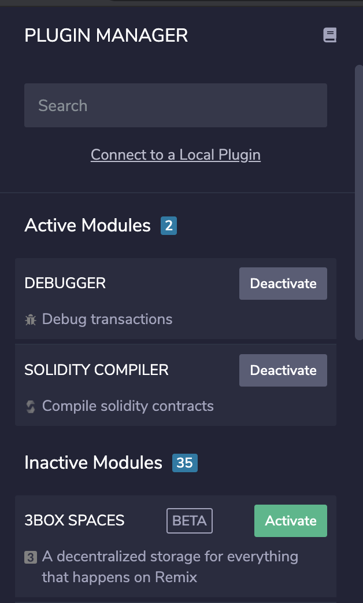
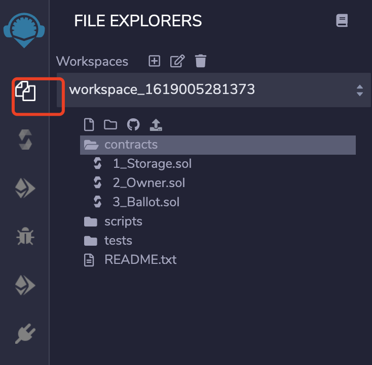
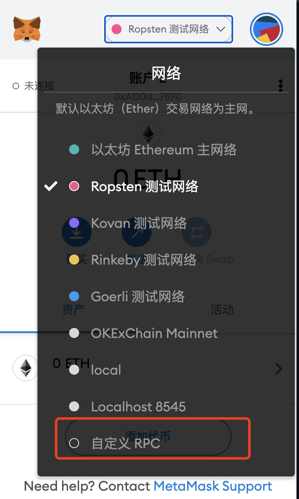
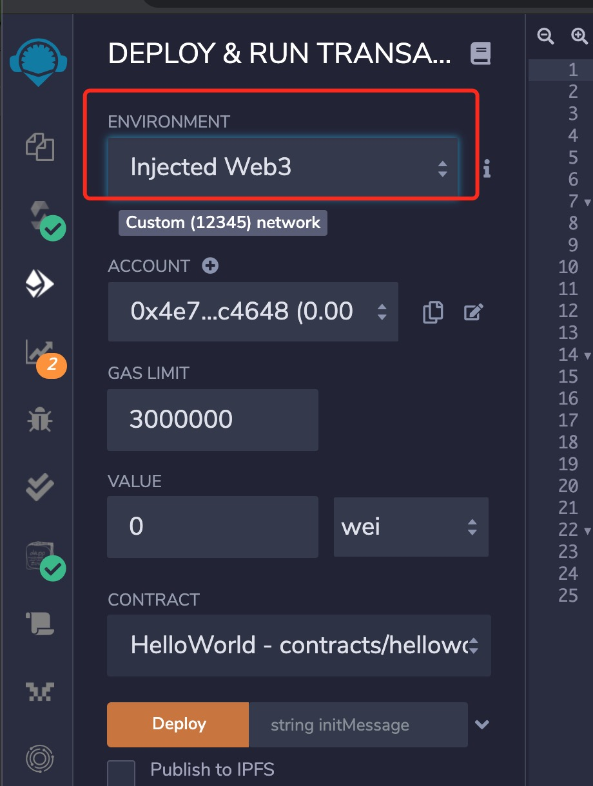
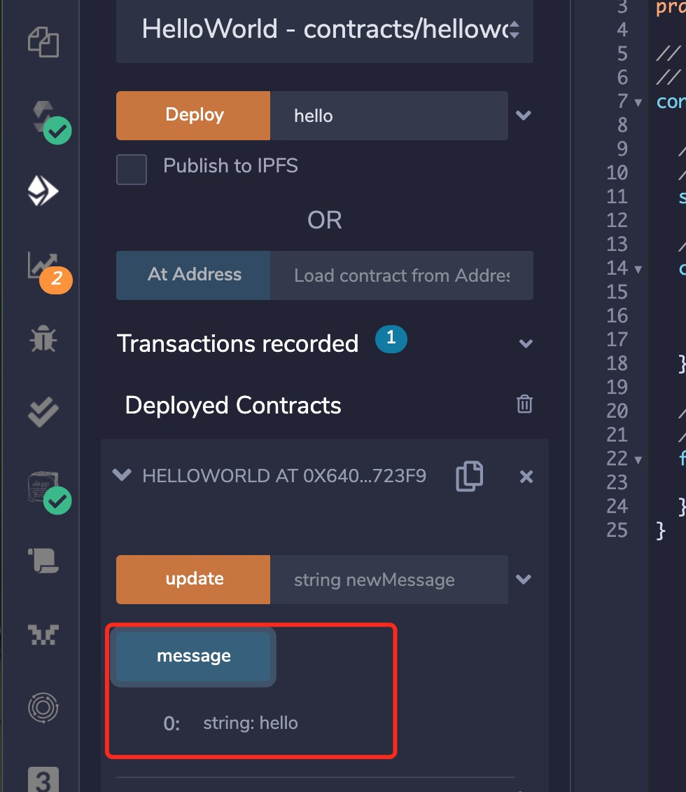

# Ontology支持EVM的介绍

ontology目前已支持EVM合约，开发者可以在ontology链上部署和调用EVM合约, 并且支持ethereum相关的合约调用工具如web3js等。


* [Ontology支持EVM的介绍](#Ontology支持EVM的介绍)
  * [1 Developer Quick Start](#1-Developer-Quick-Start)
  * [2 部署EVM合约到ontology链](#2-部署EVM合约到ontology链)
    * [2.1 使用Remix工具](#21-使用Remix工具)
      * [2.1.1 Remix环境初始化](#211-Remix环境初始化)
      * [2.1.2 编译合约](#212-编译合约)
      * [2.1.3 部署合约](#213-部署合约)
      * [2.1.4 调用合约](#214-调用合约)
    * [2.2 使用Truffle](#22-使用Truffle)
      * [2.2.1 安装truffle](#221-安装truffle)
      * [2.2.2 配置truffle-config](#222-配置truffle-config)
      * [2.2.3 部署合约到ontology链](#223-部署合约到ontology链)
    * [2.3 使用Hardhat](#23-使用Hardhat)
      * [2.3.1 搭建Hardhat开发环境](#231-搭建Hardhat开发环境)
      * [2.3.2 配置hardhat-config](#232-配置hardhat-config)
      * [2.3.3 部署合约到ontology链](#233-部署合约到ontology链)
  * [3 网络详情](#3-网络详情)
    * [3.1 节点网络](#31-节点网络)
    * [3.2 ontology链上EVM资产列表](#32-ontology链上EVM资产列表)
  * [4 钱包使用](#4-钱包使用)
    * [4.1 Metamask](#41-Metamask)
      * [4.1.1 初始化Web3](#411-初始化Web3)
      * [4.1.2 获取账户](#412-获取账户)
      * [4.1.3 初始化你的合约](#413-初始化你的合约)
      * [4.1.4 调用函数](#414-调用函数)
  * [5 ethereum链上的资产跨到ontology链上](#5-ethereum链上的资产跨到ontology链上)
  * [6 在ontology链上开发一个新的EVM合约](#6-在ontology链上开发一个新的EVM合约)
    * [6.1 环境准备](#61-环境准备)
    * [6.2 红包合约设计](#62-红包合约设计)
      * [6.2.1 红包合约逻辑](#621-红包合约逻辑)
      * [6.2.2 定义合约事件](#622-定义合约事件)
      * [6.2.3 定义函数](#623-定义函数)
    * [6.3 使用hardhat编译和测试合约](#63-使用hardhat编译和测试合约)
      * [6.3.1 使用如下命令创建一个hardhat项目](#631-使用如下命令创建一个hardhat项目)
      * [6.3.2 修改hardhat.config.js文件](#633-修改hardhat.config.js文件)
      * [6.3.3 红包合约](#634-红包合约)
      * [6.3.4 在test文件夹下添加测试代码](#635-在test文件夹下添加测试代码)
      * [6.3.5 编译合约](#636-编译合约)
      * [6.3.6 测试合约](#637-测试合约)
  * [7 API参考](#7-API参考)
    * [7.1 net_version](#71-net_version)
    * [7.2 eth_chainId](#72-eth_chainId)
    * [7.3 eth_blockNumber](#73-eth_blockNumber)
    * [7.4 eth_getBalance](#74-eth_getBalance)
    * [7.5 eth_protocolVersion](#75-eth_protocolVersion)
    * [7.6 eth_syncing](#76-eth_syncing)
    * [7.7 eth_gasPrice](#77-eth_gasPrice)
    * [7.8 eth_getStorageAt](#78-eth_getStorageAt)
    * [7.9 eth_getTransactionCount](#79-eth_getTransactionCount)
    * [7.10 eth_getBlockTransactionCountByHash](#710-eth_getBlockTransactionCountByHash)
    * [7.11 eth_getBlockTransactionCountByNumber](#711-eth_getBlockTransactionCountByNumber)
    * [7.12 eth_getCode](#712-eth_getCode)
    * [7.13 eth_getTransactionLogs](#713-eth_getTransactionLogs)
    * [7.14 eth_sendRawTransaction](#714-eth_sendRawTransaction)
    * [7.15 eth_call](#715-eth_call)
    * [7.16 eth_estimateGas](#716-eth_estimateGas)
    * [7.17 eth_getBlockByNumber](#717-eth_getBlockByNumber)
    * [7.18 eth_getBlockByHash](#718-eth_getBlockByHash)
    * [7.19 eth_getTransactionByHash](#719-eth_getTransactionByHash)
    * [7.20 eth_getTransactionByBlockHashAndIndex](#720-eth_getTransactionByBlockHashAndIndex)
    * [7.21 eth_getTransactionByBlockNumberAndIndex](#721-eth_getTransactionByBlockNumberAndIndex)
    * [7.22 eth_getTransactionReceipt](#722-eth_getTransactionReceipt)
    * [7.23 eth_pendingTransactions](#723-eth_pendingTransactions)
    * [7.24 eth_pendingTransactionsByHash](#724-eth_pendingTransactionsByHash)
    * [7.25 net_version](#725-net_version)


## 1 Developer Quick Start

ontology目前已完全支持EVM合约，并且已支持ethereum链的节点调用方式，也就是说我们可以使用ethereum相关的合约开发工具在ontology链上开发部署测试EVM合约，比如Truffle, Remix,
Web3js等工具。

## 2 部署EVM合约到ontology链

EVM合约可以用solidity语言开发，[solidity教程](https://docs.soliditylang.org/en/v0.8.6/)，可以复用现有的以太坊合约框架开发和部署。

### 2.1 使用Remix工具

这是一个hello world 合约样例，这个合约可以用于存一段字符串，并且查询。 RemixIDE的使用教程
[Remix IDE](https://remix.ethereum.org/#optimize=false&runs=200&evmVersion=null&version=soljson-v0.8.1+commit.df193b15.js)是一个在线的ethereum合约开发工具。

#### 2.1.1 Remix环境初始化

如果你首次使用remix那么你应该在remix添加两个模块：Solidity Compiler 和 Deploy and Run Transactions。

在PLUGIN MANAGER里面寻找Solidity Compiler 和 Deploy and Run Transactions并添加到自己的编译器中。



选择solidity环境，创建HelloWorld.sol合约，将HelloWorld.sol合约复制到该文件中。



`helloworld`源码请[参考](../contract-demo/helloworlddemo/helloworld.sol)

#### 2.1.2 编译合约

点击Solidity Compiler按钮，选择编译器版本为0.5.10，编译HelloWorld.sol。

#### 2.1.3 部署合约

- 现在我们可以将合约部署到Ontology网络中，在部署合约之前，我们需要将metamask连接到本体网络。
- 选择自定义RPC网络，输入如下的配置信息，最后保存我们输入的配置。
    - 输入网络名 - "ontology testnet"
    - 输入节点url - "http://polaris1.ont.io:20339"或"http://polaris2.ont.io:20339"或"http://polaris3.ont.io:20339"
    - 输入Chain ID - 5851
    - 输入区块链浏览器url - "https://explorer.ont.io/testnet"
- 去本体[Faucet地址](https://developer.ont.io/)领取ONG。
- 现在我们可以将HelloWorld合约部署到Ontology网络上。
- 在Environment中选择Injected Web3选项，点击deploy完成合约部署。
- 

remix环境如下图


#### 2.1.4 调用合约

合约部署后，我们就可以调用合约中的方法了，部署的时候，会将"hello"字符串存入合约， 现在我们调用合约的"message"方法查询，如下图所示


### 2.2 使用Truffle

完整的测试代码在[这里](../contract-demo/truffledemo)

#### 2.2.1 安装truffle

开发环境初始化，首先安装truffle环境允许需要的依赖。

- [Node.js v8+ LTS and npm](https://nodejs.org/en/) (comes with Node)
- [Git](https://git-scm.com/)

使用如下命令安装truffle

```shell
npm install -g truffle
```

truffle详细教程请参考[教程](https://www.trufflesuite.com/docs/truffle/quickstart)

#### 2.2.2 配置truffle-config

- 创建`.secret`存储测试助记词或者私钥, 账户的助记词或者私钥可以在metamask里面找到。
- 修改truffle-config，如下

```
const HDWalletProvider = require('@truffle/hdwallet-provider');
const fs = require('fs');
const mnemonic = fs.readFileSync(".secret").toString().trim();
module.exports = {
  networks: {
    ontology: {
     provider: () => new HDWalletProvider(mnemonic, `http://polaris2.ont.io:20339`),
     network_id: 5851,
     port: 20339,            // Standard Ethereum port (default: none)
     timeoutBlocks: 200,
     gas:800000,
     skipDryRun: true
    }
  },
  compilers: {
    solc: {
      version: "0.5.16",    // Fetch exact version from solc-bin (default: truffle's version)
      docker: false,        // Use "0.5.1" you've installed locally with docker (default: false)
      settings: {          // See the solidity docs for advice about optimization and evmVersion
       optimizer: {
         enabled: true,
         runs: 200
       },
       evmVersion: "byzantium"
      }
    }
  }
};
```

#### 2.2.3 部署合约到ontology链

执行如下的命令部署合约

```
truffle migrate --network ontology
```

显示如下输出则代表部署成功，在编写测试脚本是注意尽量不要使用以太坊代币的单位（如wei，gwei，ether等）。

```
Compiling your contracts...
===========================
> Everything is up to date, there is nothing to compile.

Starting migrations...
======================
> Network name:    'ontology'
> Network id:      12345
> Block gas limit: 0 (0x0)
1_initial_migration.js
======================

   Replacing 'Migrations'
   ----------------------
   > transaction hash:    0x9019551f3d60611e1bc6b323f3cf3020d15c8aeb06833d14ff864e24622884aa
   > Blocks: 0            Seconds: 4
   > contract address:    0x53e137A51CfD1E1b088E0d921eB5dBCF9cFa955E
   > block number:        6264
   > block timestamp:     1624876467
   > account:             0x4e7946D1Ee8f8703E24C6F3fBf032AD4459c4648
   > balance:             0.00001
   > gas used:            172969 (0x2a3a9)
   > gas price:           0 gwei
   > value sent:          0 ETH
   > total cost:          0 ETH


   > Saving migration to chain.
   > Saving artifacts
   -------------------------------------
   > Total cost:                   0 ETH


2_deploy_migration.js
=====================

   Replacing 'HelloWorld'
   ----------------------
   > transaction hash:    0xf8289b96f2496a8c940ca38d736a554a90f64d927b689921781619499906721b
   > Blocks: 0            Seconds: 4
   > contract address:    0xfbff9bd546B0e0D4b40f6f758847b70050d01b37
   > block number:        6266
   > block timestamp:     1624876479
   > account:             0x4e7946D1Ee8f8703E24C6F3fBf032AD4459c4648
   > balance:             0.00001
   > gas used:            243703 (0x3b7f7)
   > gas price:           0 gwei
   > value sent:          0 ETH
   > total cost:          0 ETH

hello contract address: 0xfbff9bd546B0e0D4b40f6f758847b70050d01b37

   > Saving migration to chain.
   > Saving artifacts
   -------------------------------------
   > Total cost:                   0 ETH


Summary
=======
> Total deployments:   2
> Final cost:          0 ETH
```

### 2.3 使用Hardhat

完整的例子在[这里](https://github.com/lucas7788/hardhatdemo)

#### 2.3.1 搭建Hardhat开发环境

[hardhat安装教程](https://hardhat.org/getting-started/)

#### 2.3.2 配置hardhat-config

- 修改hardhat.config.js文件，如下面的代码
- 创建".secret"用于存储测试用户的私钥

```
require("@nomiclabs/hardhat-waffle");

module.exports = {
    defaultNetwork: "ontology_testnet",
    networks: {
        hardhat: {},
        ontology_testnet: {
            url: "http://polaris2.ont.io:20339",
            chainId: 5851,
            gasPrice:500,
            gas:2000000,
            timeout:10000000,
            accounts: ["59c6995e998f97a5a0044966f0945389dc9e86dae88c7a8412f4603b6b78690d","6b98389b8bb98ccaa68876efdcbacc4ae923600023be6b4091e69daa59ba9a9d"]
        }
    },
    solidity: {
        version: "0.8.0",
        settings: {
            optimizer: {
                enabled: true,
                runs: 200
            }
        }
    },
};
```

#### 2.3.3 部署合约到ontology链

在项目根目录下执行下面的命令

```
$ npx hardhat run scripts/sample-script.js --network ontology_testnet
```

执行结果

```
sss@sss hardhatdemo % npx hardhat run scripts/sample-script.js --network ontology_testnet
RedPacket deployed to: 0xB105388ac7F019557132eD6eA90fB4BAaFde6E81
```

## 3 网络详情

### 3.1 节点网络

主网信息

|name|value| 
|:---|:---|
|NetworkName|Ontology Mainnet|
|chainId|58| 
|Gas Token|ONG Token| 
|RPC|http://dappnode1.ont.io:20339,http://dappnode2.ont.io:20339,http://dappnode3.ont.io:20339,http://dappnode4.ont.io:20339|
|Block Explorer|https://explorer.ont.io/|

测试网信息

|name|value| 
|:---|:---|
|NetworkName|Ontology Testnet|
|chainId|5851| 
|Gas Token|ONG Token| 
|RPC|http://polaris1.ont.io:20339, http://polaris2.ont.io:20339, http://polaris3.ont.io:20339,http://polaris4.ont.io:20339|
|Block Explorer|https://explorer.ont.io/testnet|

### 3.2 ontology链上EVM资产列表

|tokenName|tokenAddress|
|:---|:---|
|ONG|0x00000000000000000000000000000000000000000|

### 3.3 oep4资产列表

### 3.4 手续费ONG

领取测试币[ONG](https://developer.ont.io/)

## 4 钱包使用

### 4.1 Metamask

Metamask是一个用户用于使用自己设定密码管理以太坊钱包私钥的插件，它是一个非托管的钱包，这意味着用户有权限自己管理自己的私钥，一旦丢失该私钥用户将无法恢复对钱包的使用。

**Type**: Non-custodial/HD
**Private Key Storage**: User’s local browser storage
**Communication to Ethereum Ledger**: Infura
**Private key encoding**: Mnemonic

4.1.1 初始化Web3

Step 1:

在你的DApp内安装web3环境:

   ```
   npm install --save web3
   ```

生成一个新的文件，命名为 `web3.js` ，将以下代码复制到该文件:

   ```js
   import Web3 from 'web3';

const getWeb3 = () => new Promise((resolve) => {
    window.addEventListener('load', () => {
        let currentWeb3;

        if (window.ethereum) {
            currentWeb3 = new Web3(window.ethereum);
            try {
                // Request account access if needed
                window.ethereum.enable();
                // Acccounts now exposed
                resolve(currentWeb3);
            } catch (error) {
                // User denied account access...
                alert('Please allow access for the app to work');
            }
        } else if (window.web3) {
            window.web3 = new Web3(web3.currentProvider);
            // Acccounts always exposed
            resolve(currentWeb3);
        } else {
            console.log('Non-Ethereum browser detected. You should consider trying MetaMask!');
        }
    });
});

export default getWeb3;
   ```

简言之，只要你在你的Chrome浏览器里安装了Metamask插件，你就可以使用该插件注入的`ethereum`全局变量。

Step 2:

在你的client里引入如下代码,

   ```js
   import getWeb3 from '/path/to/web3';
   ```

调用如下函数:

   ```js
     getWeb3()
    .then((result) => {
        this.web3 = result;// we instantiate our contract next
    });
   ```

4.1.2 获取账户

我们需要从以上创建的web3实例中获取一个账户来发送交易。

   ```js
     this.web3.eth.getAccounts()
    .then((accounts) => {
        this.account = accounts[0];
    })
   ```

`getAccounts()` 函数 返回了metamask中的账户, `accounts[0]` 是当前用户的.

4.1.3 初始化你的合约

4.1.4 调用函数

现在你可以使用你刚才创建的合约实例调用任何你想调用的函数

注:
- 你可以使用 `send()` 函数调用合约来改变合约状态
- 调用 `call()` 函数完成合约的预执行操作

**Calling `call()` Functions**

```js
  this.myContractInstance.methods.myMethod(myParams)
    .call()
    .then(
        // do stuff with returned values
    )
```

**Calling `send()` Functions**

```
this.myContractInstance.methods.myMethod(myParams)
.send({
from: this.account,gasPrice: 0
}).then (
(receipt) => {
  // returns a transaction receipt}
);
```

## 5 ethereum链上的资产跨到ontology链上

[PolyBridge](https://bridge.poly.network/)

## 6 在ontology链上开发一个新的EVM合约

这部分我们会使用`hardhat`工具开发部署和测试EVM合约。

### 6.1 环境准备

- nodejs

[nodejs 安装文档](https://nodejs.org/en/) 如果您的电脑已经安装请忽略。

- hardhat

[hardhat安装教程](https://hardhat.org/getting-started/)。

### 6.2 红包合约设计

#### 6.2.1 红包合约逻辑

我们会开发一本发红包的合约例子，主要提供以下功能

- 发红包
- 领红包

每次发红包要指定该红包的大小和该红包的数量，例如，一个红包的大小是100个token，红包的数量是10， 也就是每个地址可以领10个token， 总共可以有10个不同的地址领取该红包。为了简单起见，每个红包的大小设置为一样。
以上的逻辑我们可以设置如下的存储结构

```
EIP20Interface public token; // support token address
uint public nextPacketId; // the next redpacket ID

// packetId -> Packet, store all the redpacket
mapping(uint => Packet) public packets;

//packetId -> address -> bool,  store receive redpacket record
mapping(uint => mapping(address => bool)) public receiveRecords;

struct Packet {
    uint[] assetAmounts;// Number of tokens per copy
    uint receivedIndex; // Number of red packets received
}
```

#### 6.2.2 定义合约事件

在合约执行的过程中，我们可以通过添加事件，来追溯合约执行流程。在该合约例子中，我们会设计两个事件，
一个是发红包时，合约会生成红包的ID,该ID要通过事件推送给调用者；另外一个事件是领取红包时，需要推送一个事件用来记录领取的红包ID和token数量。

```
event SendRedPacket(uint packetId, uint amount);
event ReceiveRedPacket(uint packetId, uint amount);
```

#### 6.2.3 定义函数

- `sendRedPacket`

发红包，任何人都可以调用该接口，将一定量的token打给该合约地址，从而其他的地址可以从该合约地址领取红包。有一点需要注意的是，在调用该方法之前，
需要先授权该合约地址能够从用户的地址把token转移走，所以需要先调用该token的 `approve`方法。

```
function sendRedPacket(uint amount, uint packetNum) public payable returns (uint) {
    require(amount >= packetNum, "amount >= packetNum");
    require(packetNum > 0 && packetNum < 100, "packetNum>0 && packetNum < 100");
    uint before = token.universalBalanceOf(address(this));
    token.universalTransferFrom(address(msg.sender), address(this), amount);
    uint afterValue = token.universalBalanceOf(address(this));
    uint delta = afterValue - before;
    uint id = nextPacketId;
    uint[] memory assetAmounts = new uint[](packetNum);
    for (uint i = 0; i < packetNum; i++) {
        assetAmounts[i] = delta / packetNum;
    }
    packets[id] = Packet({assetAmounts : assetAmounts, receivedIndex : 0});
    nextPacketId = id + 1;
    emit SendRedPacket(id, amount);
    return id;
}
```

- `receivePacket`

领取红包，任何地址都可以通过调用该接口领取红包，调用该接口的时候需要指定红包的ID，也就是指定要领取哪个红包。

```
function receivePacket(uint packetId) public payable returns (bool) {
    require(packetId < nextPacketId, "not the redpacket");
    Packet memory p = packets[packetId];
    if (p.assetAmounts.length < 1) {
        return false;
    }
    require(p.receivedIndex < p.assetAmounts.length - 1, "It's over");
    require(receiveRecords[packetId][address(msg.sender)] == false, "has received");
    p.receivedIndex = p.receivedIndex + 1;
    bool res = token.universalTransfer(msg.sender, p.assetAmounts[p.receivedIndex]);
    require(res, "token transfer failed");
    packets[packetId] = p;
    receiveRecords[packetId][address(msg.sender)] == true;
    emit ReceiveRedPacket(packetId, p.assetAmounts[p.receivedIndex]);
    return true;
}
```

[合约完整的代码](../contract-demo/hardhatdemo/contracts/Redpacket.sol)

### 6.3 使用hardhat编译和测试合约

#### 6.3.1 使用如下命令创建一个hardhat项目

```
mkdir hardhatdemo
cd hardhatdemo
npm init
npm install --save-dev hardhat
npx hardhat
```

#### 6.3.2 修改hardhat.config.js文件

添加测试网节点配置信息

```
module.exports = {
    defaultNetwork: "ontology_testnet",
    networks: {
        hardhat: {},
        ontology_testnet: {
            url: "http://polaris2.ont.io:20339",
            chainId: 5851,
            gasPrice:500,
            gas:2000000,
            timeout:10000000,
            accounts: ["59c6995e998f97a5a0044966f0945389dc9e86dae88c7a8412f4603b6b78690d",
            "0x6b98389b8bb98ccaa68876efdcbacc4ae923600023be6b4091e69daa59ba9a9d"]
        }
    },
    solidity: {
        version: "0.8.0",
        settings: {
            optimizer: {
                enabled: true,
                runs: 200
            }
        }
    },
};
```

accounts字段指定的私钥数组，对应的地址需要有测试网的ONG,用于付交易的手续费，可以去[这里](https://developer.ont.io/)领取测试网ONG。

#### 6.3.3 红包合约

把之前的红包合约代码文件放到 `contracts`文件夹下，为了支持ERC20的转账，我们还需要
`EIP20Interface.sol`, `UniversalERC20.sol`, 和 `TokenDemo.sol`
文件，可以从[此处](../contract-demo/hardhatdemo/contracts)下载相关文件

#### 6.3.4 在test文件夹下添加测试代码

```
describe("RedPacket", function () {
    let tokenDemo, redPacket, owner, acct1, assetAmount, packetAmount;
    beforeEach(async function () {
        const TokenDemo = await ethers.getContractFactory("TokenDemo");
        tokenDemo = await TokenDemo.deploy(10000000, "L Token", 18, "LT");
        await tokenDemo.deployed();
        const RedPacket = await ethers.getContractFactory("RedPacket");
        redPacket = await RedPacket.deploy(tokenDemo.address);
        await redPacket.deployed();
        [owner, acct1] = await ethers.getSigners();
        assetAmount = 1000;
        packetAmount = 10;
    });
    it("token", async function () {
        expect(await redPacket.token()).to.equal(tokenDemo.address);
    });
    it("sendRedPacket", async function () {
        const approveTx = await tokenDemo.approve(redPacket.address, assetAmount);
        await approveTx.wait();

        const sendRedPacketTx = await redPacket.sendRedPacket(assetAmount, packetAmount);
        await sendRedPacketTx.wait();
        let balance = await tokenDemo.balanceOf(redPacket.address);
        expect(balance.toString()).to.equal(assetAmount.toString());

        res = await redPacket.nextPacketId();
        expect(res.toString()).to.equal("1");

        await redPacket.connect(acct1).receivePacket(0);
        balance = await tokenDemo.balanceOf(acct1.address);
        expect(balance.toString()).to.equal((assetAmount / packetAmount).toString());
    });
});
```

#### 6.3.5 编译合约

在项目根目录执行如下的命令编译合约，

```
$ npx hardhat compile
Compiling 5 files with 0.8.0
Compilation finished successfully
```

该命令执行完成后会生成如下的文件夹

```
.
├── artifacts
├── cache
├── contracts
├── hardhat.config.js
├── node_modules
├── package-lock.json
├── package.json
├── scripts
└── test
```

#### 6.3.6 测试合约

```
npx hardhat test
```

执行结果如下图

```
sss@sss hardhatdemo % npx hardhat test
  RedPacket
    ✓ token
    ✓ sendRedPacket (16159ms)


  2 passing (41s)
```

## 7 API参考

由于以太坊与本体交易的结构体和存储结构存在差异，目前本体只支持了以太坊部分RPC接口（ontology部分接口返回的内容与以太坊返回的有所不同），具体如下：

### 7.1 net_version

返回当前连接网络的ID。

- 参数：无
- 返回值
    - `String` - 当前连接网络的ID，"1"表示Ontology Mainnet

- 示例代码

请求：

```shell
curl -X POST --data '{"jsonrpc":"2.0","method":"net_version","params":[],"id":67}'
```

响应：

```json
{
  "id": 67,
  "jsonrpc": "2.0",
  "result": "1"
}
```

### 7.2 eth_chainId

返回当前链的chainId。

- 参数：无

- 返回值
    - `String`： 当前连接网络的ID

- 示例代码

请求：

```shell
curl -X POST --data '{"jsonrpc":"2.0","method":"eth_chainId","params":[],"id":83}'
```

响应：

```json
{
  "id": 83,
  "jsonrpc": "2.0",
  "result": "0x00"
}
```

### 7.3 eth_blockNumber

返回最新块的编号。

- 参数
- 返回值
    - `QUANTITY`： 节点当前块编号

- 示例代码

请求：

```
curl -X POST --data '{"jsonrpc":"2.0","method":"eth_blockNumber","params":[],"id":83}'
```

响应：

```
{
  "id":83,
  "jsonrpc": "2.0",
  "result": "0x4b7" // 1207
}
```

### 7.4 eth_getBalance

返回指定地址账户的余额。

- 参数
    - `DATA`： 20字节，要检查余额的地址
    - `QUANTITY|TAG`： 整数块编号，或者字符串"latest", "earliest" 或 "pending"

参数示例：

```
params: [
   '0x407d73d8a49eeb85d32cf465507dd71d507100c1',
   'latest'
]
```

- 返回值
    - `QUANTITY`： 当前余额，单位：wei

- 示例代码

请求：

```
curl -X POST --data '{"jsonrpc":"2.0","method":"eth_getBalance","params":["0x407d73d8a49eeb85d32cf465507dd71d507100c1", "latest"],"id":1}'
```

响应：

```
{
  "id":1,
  "jsonrpc": "2.0",
  "result": "0x0234c8a3397aab58" // 158972490234375000
}
```

### 7.5 eth_protocolVersion

返回当前以太坊协议的版本。

- 参数
- 返回值
    - `String`: 当前的以太坊协议版本

- 示例代码

请求：

```shell
curl -X POST --data '{"jsonrpc":"2.0","method":"eth_protocolVersion","params":[],"id":67}'
```

响应：

```
{
  "id":67,
  "jsonrpc": "2.0",
  "result": "65"
}
```

### 7.6 eth_syncing

对于已经同步的客户端，该调用返回一个描述同步状态的对象。

- 参数
- 返回值
  `Object|Boolean`, 同步状态对象或false。同步对象的结构如下：
    - startingBlock: QUANTITY - 开始块
    - currentBlock: QUANTITY - 当前块，同eth_blockNumber
    - highestBlock: QUANTITY - 预估最高块

- 示例代码

请求：

```
curl -X POST --data '{"jsonrpc":"2.0","method":"eth_syncing","params":[],"id":1}'
```

响应：

```
{
  "id":1,
  "jsonrpc": "2.0",
  "result": {
    startingBlock: '0',
    currentBlock: '0x386',
    highestBlock: '0x454'
  }
}
```

### 7.7 eth_gasPrice

返回当前的gas价格，单位：wei。

- 参数
- 返回值
    - `QUANTITY`: 整数，以wei为单位的当前gas价格

- 示例代码

请求：

```
curl -X POST --data '{"jsonrpc":"2.0","method":"eth_gasPrice","params":[],"id":73}'
```

响应：

```
{
  "id":73,
  "jsonrpc": "2.0",
  "result": "0x09184e72a000" // 10000000000000
}
```

### 7.8 eth_getStorageAt

返回指定地址存储位置的值。

- 参数
    - `DATA`: 20字节，存储地址
    - `QUANTITY`: 存储中的位置号
    - `QUANTITY|TAG`: 整数块号，或字符串"latest"、"earliest" 或"pending"（该参数为无效参数）

- 返回值
  `DATA`: 指定存储位置的值

- 示例代码

根据要提取的存储计算正确的位置。考虑下面的合约，由`0x391694e7e0b0cce554cb130d723a9d27458f9298` 部署在地址`0x295a70b2de5e3953354a6a8344e616ed314d7251`：

```
contract Storage {
    uint pos0;
    mapping(address => uint) pos1;

    function Storage() {
        pos0 = 1234;
        pos1[msg.sender] = 5678;
    }
}
```

提取pos0的值很直接：

```
curl -X POST --data '{"jsonrpc":"2.0", "method": "eth_getStorageAt", "params": ["0x295a70b2de5e3953354a6a8344e616ed314d7251", "0x0", "latest"], "id": 1}' localhost:8545
```

响应结果：

```
{"jsonrpc":"2.0","id":1,"result":"0x00000000000000000000000000000000000000000000000000000000000004d2"}
```

要提取映射表中的成员就难一些了。映射表中成员位置的计算如下：

```
keccack(LeftPad32(key, 0), LeftPad32(map position, 0))
```

这意味着为了提取`pos1["0x391694e7e0b0cce554cb130d723a9d27458f9298"]`的值，我们需要如下计算：

```
keccak(decodeHex("000000000000000000000000391694e7e0b0cce554cb130d723a9d27458f9298" + "0000000000000000000000000000000000000000000000000000000000000001"))
```

geth控制台自带的web3库可以用来进行这个计算：

```
> var key = "000000000000000000000000391694e7e0b0cce554cb130d723a9d27458f9298" + "0000000000000000000000000000000000000000000000000000000000000001"
undefined
> web3.sha3(key, {"encoding": "hex"})
"0x6661e9d6d8b923d5bbaab1b96e1dd51ff6ea2a93520fdc9eb75d059238b8c5e9"
```

现在可以提取指定位置的值了：

```
curl -X POST --data '{"jsonrpc":"2.0", "method": "eth_getStorageAt", "params": ["0x295a70b2de5e3953354a6a8344e616ed314d7251", "0x6661e9d6d8b923d5bbaab1b96e1dd51ff6ea2a93520fdc9eb75d059238b8c5e9", "latest"], "id": 1}' localhost:8545
```

相应结果如下：

```
{"jsonrpc":"2.0","id":1,"result":"0x000000000000000000000000000000000000000000000000000000000000162e"}
```

### 7.9 eth_getTransactionCount

返回指定地址发生的使用EVM虚拟机交易数量。

- 参数
    - `DATA`: 20字节，地址
    - `QUANTITY|TAG`: 整数块编号，或字符串"latest"、"earliest"或"pending"

```
params: [
   '0x407d73d8a49eeb85d32cf465507dd71d507100c1',
   'latest' // state at the latest block
]
```

- 返回值

`QUANTITY` - 从指定地址发出的交易数量，整数

- 示例代码

请求：

```
curl -X POST --data '{"jsonrpc":"2.0","method":"eth_getTransactionCount","params":["0x407d73d8a49eeb85d32cf465507dd71d507100c1","latest"],"id":1}'
```

响应：

```
{
  "id":1,
  "jsonrpc": "2.0",
  "result": "0x1" // 1
}
```

### 7.10 eth_getBlockTransactionCountByHash

返回指定块内的使用EVM虚拟机交易数量，使用哈希来指定块。

- 参数
    - `DATA`: 32字节，块哈希

```
params: [
   '0xb903239f8543d04b5dc1ba6579132b143087c68db1b2168786408fcbce568238'
]
```

- 返回值
    - `QUANTITY` - 指定块内的交易数量，整数

- 示例代码

请求：

```
curl -X POST --data '{"jsonrpc":"2.0","method":"eth_getBlockTransactionCountByHash","params":["0xb903239f8543d04b5dc1ba6579132b143087c68db1b2168786408fcbce568238"],"id":1}'
```

响应：

```
{
  "id":1,
  "jsonrpc": "2.0",
  "result": "0xb" // 11
}
```

### 7.11 eth_getBlockTransactionCountByNumber

返回指定块内的交易数量，使用块编号指定块。

- 参数
    - `QUANTITY|TAG`: 整数块编号，或字符串"earliest"、"latest"或"pending"

```
params: [
   '0xe8', // 232
]
```

- 返回值
    - `QUANTITY`: 指定块内的交易数量

- 示例代码

请求：

```
curl -X POST --data '{"jsonrpc":"2.0","method":"eth_getBlockTransactionCountByNumber","params":["0xe8"],"id":1}'
```

响应：

```
{
  "id":1,
  "jsonrpc": "2.0",
  "result": "0xa" // 10
}
```

### 7.12 eth_getCode

返回指定地址的代码。

- 参数
    - `DATA`: 20字节，地址
    - `QUANTITY|TAG`: 整数块编号，或字符串"latest"、"earliest" 或"pending"（无效参数）

```
params: [
   '0xa94f5374fce5edbc8e2a8697c15331677e6ebf0b',
   '0x2'  // 2
]
```

- 返回值
    - `DATA`: 指定地址处的代码

- 示例代码

请求：

```
curl -X POST --data '{"jsonrpc":"2.0","method":"eth_getCode","params":["0xa94f5374fce5edbc8e2a8697c15331677e6ebf0b", "0x2"],"id":1}'
```

响应：

```
{
  "id":1,
  "jsonrpc": "2.0",
  "result": "0x600160008035811a818181146012578301005b601b6001356025565b8060005260206000f25b600060078202905091905056"
}
```

### 7.13 eth_getTransactionLogs

返回交易执行的日志。

- 参数
    - `txHash`: 交易哈希

- 返回值 返回交易执行日志

- 示例代码

请求：

```
curl -X POST --data '{
     "jsonrpc": "2.0",
     "id": 2233,
     "method": "eth_getTransactionLogs",
     "params": [
       "0x4a9e7c5ec484c1cb854d2831ff51f66f2771e8143362aa75c84f0c6544048fba"
     ]
   }'
```

响应：

```
{
    "jsonrpc": "2.0",
    "id": 2233,
    "result": [
        {
            "address": "0x9ea0eff7153cebbdd18c2ca3bad818e29e556ba7",
            "topics": [
                "0x7ac369dbd14fa5ea3f473ed67cc9d598964a77501540ba6751eb0b3decf5870d"
            ],
            "data": "0x0000000000000000000000000000000000000000000000000000000000000000000000000000000000000000f4ffabb197396c7f48c9cd47ec462b54ed9ce84c",
            "blockNumber": "0x25b",
            "transactionHash": "0x4a9e7c5ec484c1cb854d2831ff51f66f2771e8143362aa75c84f0c6544048fba",
            "transactionIndex": "0x0",
            "blockHash": "0x77abadf9e4ad688212a70260244987f6623b54b56ea737a2cfbc7e7a6344eddc",
            "logIndex": "0x0",
            "removed": false
        }
    ]
}
```

### 7.14 eth_sendRawTransaction

为签名交易创建一个新的消息调用交易或合约。

- 参数
    - `DATA`: 签名的交易数据

- 返回值
    - `DATA`: 32字节，交易哈希，如果交易未生效则返回全0哈希。

当创建合约时，在交易生效后，使用`eth_getTransactionReceipt`获取合约地址。

- 示例代码

请求：

```
curl -X POST --data '{"jsonrpc":"2.0","method":"eth_sendRawTransaction","params":[{see above}],"id":1}'
```

响应：

```
{
  "id":1,
  "jsonrpc": "2.0",
  "result": "0xe670ec64341771606e55d6b4ca35a1a6b75ee3d5145a99d05921026d1527331"
}
```

### 7.15 eth_call

立刻执行一个新的消息调用，无需在区块链上创建交易。

- 参数
    - `Object`: 交易调用对象
        - from: DATA, 20 Bytes - 发送交易的原地址，可选
        - to: DATA, 20 Bytes - 交易目标地址
        - gas: QUANTITY - 交易可用gas量，可选。eth_call不消耗gas，但是某些执行环节需要这个参数
        - gasPrice: QUANTITY - gas价格，可选
        - value: QUANTITY - 交易发送的以太数量，可选
        - data: DATA - 方法签名和编码参数的哈希，可选
        - QUANTITY|TAG - 整数块编号，或字符串"latest"、"earliest"或"pending"

- 返回值
    - `DATA`: 所执行合约的返回值

- 示例代码

请求：

```
curl -X POST --data '{"jsonrpc":"2.0","method":"eth_call","params":[{see above}],"id":1}'
```

响应：

```
{
  "id":1,
  "jsonrpc": "2.0",
  "result": "0x"
}
```

### 7.16 eth_estimateGas

执行并估算一个交易需要的gas用量。该次交易不会写入区块链。注意，由于多种原因，例如EVM的机制 及节点旳性能，估算的数值可能比实际用量大的多。

- 参数

参考`eth_call`调用的参数，所有的属性都是可选的。如果没有指定gas用量上限，geth将使用挂起块的gas上限。 在这种情况下，返回的gas估算量可能不足以执行实际的交易。

- 返回值
    - `QUANTITY`: gas用量估算值

- 示例代码

请求：

```
curl -X POST --data '{"jsonrpc":"2.0","method":"eth_estimateGas","params":[{see above}],"id":1}'
```

返回值：

```
{
  "id":1,
  "jsonrpc": "2.0",
  "result": "0x5208" // 21000
}
```

### 7.17 eth_getBlockByNumber

返回指定编号的块。

- 参数
    - `QUANTITY|TAG`: 整数块编号，或字符串"earliest"、"latest" 或"pending"
    - `Boolean`: 为true时返回完整的交易对象，否则仅返回交易哈希

- 返回值

`Object` - 匹配的块对象，如果未找到块则返回null，结构如下：

    - number: QUANTITY - 块编号
    - hash: DATA, 32 Bytes - 块哈希
    - parentHash: DATA, 32 Bytes - 父块的哈希
    - nonce: DATA, 8 Bytes - 空
    - sha3Uncles: DATA, 32 Bytes - 空
    - logsBloom: DATA, 256 Bytes - 空
    - transactionsRoot: DATA, 32 Bytes - 块中的交易树根节点
    - stateRoot: DATA, 32 Bytes - 空
    - receiptsRoot: DATA, 32 Bytes - 空
    - miner: DATA, 20 Bytes - 空
    - difficulty: QUANTITY - 空
    - totalDifficulty: QUANTITY - 空
    - extraData: DATA - 空
    - size: QUANTITY - 本块字节数
    - gasLimit: QUANTITY - 本块允许的最大gas用量
    - gasUsed: QUANTITY - 本块中所有交易使用的总gas用量
    - timestamp: QUANTITY - 块时间戳
    - transactions: Array - 交易对象数组，或32字节长的交易哈希数组
    - uncles: Array - 空

- 示例代码

请求：

```
curl -X POST --data '{"jsonrpc":"2.0","method":"eth_getBlockByNumber","params":["0x1b4", true],"id":1}'
```

响应：

```
{
    "jsonrpc": "2.0",
    "id": 2233,
    "result": {
        "difficulty": "0x0",
        "extraData": "0x",
        "gasLimit": "0x0",
        "gasUsed": "0x0",
        "hash": "0x9e539021092397ec631cbb05fa5418e83b5cccb95dd4663180c243425f01d7b2",
        "logsBloom": "0x00000000000000000000000000000000000000000000000000000000000000000000000000000000000000000000000000000000000000000000000000000000000000000000000000000000000000000000000000000000000000000000000000000000000000000000000000000000000000000000000000000000000000000000000000000000000000000000000000000000000000000000000000000000000000000000000000000000000000000000000000000000000000000000000000000000000000000000000000000000000000000000000000000000000000000000000000000000000000000000000000000000000000000000000000000000",
        "miner": "0x0000000000000000000000000000000000000000",
        "mixHash": "0x0000000000000000000000000000000000000000000000000000000000000000",
        "nonce": "0x0000000000000000",
        "number": "0x1b4",
        "parentHash": "0xea06f581bb1e1c4a828f149106e697542bb484627e518ab905a67998d9b670dc",
        "receiptsRoot": "0x0000000000000000000000000000000000000000000000000000000000000000",
        "sha3Uncles": "0x0000000000000000000000000000000000000000000000000000000000000000",
        "size": "0xf2",
        "stateRoot": "0x",
        "timestamp": "0x60c04264",
        "totalDifficulty": "0x0",
        "transactions": [],
        "transactionsRoot": "0x0000000000000000000000000000000000000000000000000000000000000000",
        "uncles": []
    }
}
```

### 7.18 eth_getBlockByHash

返回具有指定哈希的块。

- 参数
    - `DATA`: 32字节 - 块哈希
    - `Boolean`: 为true时返回完整的交易对象，否则仅返回交易哈希

- 返回值

参考`eth_getBlockByNumber`的返回值。

- 示例代码

请求：

```
curl -X POST --data '{"jsonrpc":"2.0","method":"eth_getBlockByHash","params":["0xe670ec64341771606e55d6b4ca35a1a6b75ee3d5145a99d05921026d1527331", true],"id":1}'
```

响应：

参考`eth_getBlockByNumber`。

### 7.19 eth_getTransactionByHash

返回指定哈希对应的交易。

- 参数
    - `DATA`: 32 字节 - 交易哈希

- 返回值

`Object` - 交易对象，如果没有找到匹配的交易则返回null。结构如下：

    - hash: DATA, 32字节 - 交易哈希
    - nonce: QUANTITY - 本次交易之前发送方已经生成使用evm虚拟机的交易数量
    - blockHash: DATA, 32字节 - 交易所在块的哈希，对于挂起块，该值为null
    - blockNumber: QUANTITY - 交易所在块的编号，对于挂起块，该值为null
    - transactionIndex: QUANTITY - 交易在块中的索引位置，挂起块该值为null
    - from: DATA, 20字节 - 交易发送方地址
    - to: DATA, 20字节 - 交易接收方地址，对于合约创建交易，该值为null
    - value: QUANTITY - 发送的以太数量，单位：wei
    - gasPrice: QUANTITY - 发送方提供的gas价格，单位：wei
    - gas: QUANTITY - 发送方提供的gas可用量
    - input: DATA - 随交易发送的数据

- 示例代码

请求：

```
curl -X POST --data '{"jsonrpc":"2.0","method":"eth_getTransactionByHash","params":["0xb903239f8543d04b5dc1ba6579132b143087c68db1b2168786408fcbce568238"],"id":1}'
```

响应：

```
{
"id":1,
"jsonrpc":"2.0",
"result": {
    "hash":"0xc6ef2fc5426d6ad6fd9e2a26abeab0aa2411b7ab17f30a99d3cb96aed1d1055b",
    "nonce":"0x",
    "blockHash": "0xbeab0aa2411b7ab17f30a99d3cb9c6ef2fc5426d6ad6fd9e2a26a6aed1d1055b",
    "blockNumber": "0x15df", // 5599
    "transactionIndex":  "0x1", // 1
    "from":"0x407d73d8a49eeb85d32cf465507dd71d507100c1",
    "to":"0x85h43d8a49eeb85d32cf465507dd71d507100c1",
    "value":"0x7f110", // 520464
    "gas": "0x7f110", // 520464
    "gasPrice":"0x09184e72a000",
    "input":"0x603880600c6000396000f300603880600c6000396000f3603880600c6000396000f360",
  }
}
```

### 7.20 eth_getTransactionByBlockHashAndIndex

返回指定块内具有指定索引序号的交易。

- 参数
    - `DATA`: 32字节 - 块哈希
    - `QUANTITY`: 交易在块内的索引序号

```
params: [
   '0xe670ec64341771606e55d6b4ca35a1a6b75ee3d5145a99d05921026d1527331',
   '0x0' // 0
]
```

- 返回值

查阅`eth_getTransactionByHash`的返回值

- 示例代码

请求：

```
curl -X POST --data '{"jsonrpc":"2.0","method":"eth_getTransactionByBlockHashAndIndex","params":["0xc6ef2fc5426d6ad6fd9e2a26abeab0aa2411b7ab17f30a99d3cb96aed1d1055b", "0x0"],"id":1}'
```

返回值请参考`eth_getTransactionByHash`的返回值。

### 7.21 eth_getTransactionByBlockNumberAndIndex

返回指定编号的块内具有指定索引序号的交易。

- 参数
    - `QUANTITY|TAG` - 整数块编号，或字符串"earliest"、"latest" 或"pending"
    - `QUANTITY` - 交易索引序号

```
params: [
   '0x29c', // 668
   '0x0' // 0
]
```

- 返回值

请参考`eth_getTransactionByHash`的返回值。

- 示例代码

请求：

```
curl -X POST --data '{"jsonrpc":"2.0","method":"eth_getTransactionByBlockNumberAndIndex","params":["0x29c", "0x0"],"id":1}'
```

响应结果请参考`eth_getTransactionByHash`调用。

### 7.22 eth_getTransactionReceipt

返回指定交易的收据，使用哈希指定交易。

需要指出的是，挂起的交易其收据无效。

- 参数
    - `DATA`: 32字节 - 交易哈希

```
params: [
   '0xb903239f8543d04b5dc1ba6579132b143087c68db1b2168786408fcbce568238'
]
```

- 返回值

`Object` - 交易收据对象，如果收据不存在则为null。交易对象的结构如下：

    - transactionHash: DATA, 32字节 - 交易哈希
    - transactionIndex: QUANTITY - 交易在块内的索引序号
    - blockHash: DATA, 32字节 - 交易所在块的哈希
    - blockNumber: QUANTITY - 交易所在块的编号
    - from: DATA, 20字节 - 交易发送方地址
    - to: DATA, 20字节 - 交易接收方地址，对于合约创建交易该值为null
    - cumulativeGasUsed: QUANTITY - 交易所在块消耗的gas总量
    - gasUsed: QUANTITY - 该次交易消耗的gas用量
    - contractAddress: DATA, 20字节 - 对于合约创建交易，该值为新创建的合约地址，否则为null
    - logs: Array - 本次交易生成的日志对象数组
    - logsBloom: DATA, 256字节 - bloom过滤器，空
    - status: QUANTITY ，1 (成功) 或 0 (失败)

- 示例代码

请求：

```
curl -X POST --data '{    "jsonrpc": "2.0",
    "id": 16661,
    "method": "eth_getTransactionReceipt",
    "params": [
        "0xe15e2c2240dc58dff54f7c4561a3f784b4ac91cefd0b7cf4dad014fd8a0ad70b"
    ]'
```

响应：

```
{
    "jsonrpc": "2.0",
    "id": 16661,
    "result": {
        "blockHash": "0x747d2b4599a08c423d50ec772897c992b01b1ac1510d487be52d0167014bd063",
        "blockNumber": "0x204",
        "contractAddress": "0xddcb212ce4896bb02f79db726f6bb8588df41a5c",
        "cumulativeGasUsed": "0x13eecbeb0",
        "from": "0x96216849c49358b10257cb55b28ea603c874b05e",
        "gasUsed": "0x20a86c",
        "logs": [
            {
                "address": "0xddcb212ce4896bb02f79db726f6bb8588df41a5c",
                "topics": [
                    "0x7ac369dbd14fa5ea3f473ed67cc9d598964a77501540ba6751eb0b3decf5870d"
                ],
                "data": "0x000000000000000000000000000000000000000000000000000000000000000000000000000000000000000055354e90851d79ee31d8f27d94613cf8f5e7f9e8",
                "blockNumber": "0x204",
                "transactionHash": "0xe15e2c2240dc58dff54f7c4561a3f784b4ac91cefd0b7cf4dad014fd8a0ad70b",
                "transactionIndex": "0x0",
                "blockHash": "0x747d2b4599a08c423d50ec772897c992b01b1ac1510d487be52d0167014bd063",
                "logIndex": "0x0",
                "removed": false
            },
            {
                "address": "0xddcb212ce4896bb02f79db726f6bb8588df41a5c",
                "topics": [
                    "0xedffc32e068c7c95dfd4bdfd5c4d939a084d6b11c4199eac8436ed234d72f926"
                ],
                "data": "0x0000000000000000000000000000000000000000000000000000000000000000000000000000000000000000a5b9c59f24caa24ddd9a7ef3aec61bb4908ad984",
                "blockNumber": "0x204",
                "transactionHash": "0xe15e2c2240dc58dff54f7c4561a3f784b4ac91cefd0b7cf4dad014fd8a0ad70b",
                "transactionIndex": "0x0",
                "blockHash": "0x747d2b4599a08c423d50ec772897c992b01b1ac1510d487be52d0167014bd063",
                "logIndex": "0x1",
                "removed": false
            },
            {
                "address": "0xddcb212ce4896bb02f79db726f6bb8588df41a5c",
                "topics": [
                    "0xd604de94d45953f9138079ec1b82d533cb2160c906d1076d1f7ed54befbca97a"
                ],
                "data": "0x000000000000000000000000000000000000000000000000000000000000000000000000000000000000000056319fd5a22da14daf19394937dd562619ea34ad",
                "blockNumber": "0x204",
                "transactionHash": "0xe15e2c2240dc58dff54f7c4561a3f784b4ac91cefd0b7cf4dad014fd8a0ad70b",
                "transactionIndex": "0x0",
                "blockHash": "0x747d2b4599a08c423d50ec772897c992b01b1ac1510d487be52d0167014bd063",
                "logIndex": "0x2",
                "removed": false
            }
        ],
        "logsBloom": "0x00000000000000000000000000000000000000000000000000000000000000000000000000000000000000000000000000000000000000000000000000000000000000000000000000000000000000000000000000000000000000000000000000000000000000000000000000000000000000000000000000000000000000000000000000000000000000000000000000000000000000000000000000000000000000000000000000000000000000000000000000000000000000000000000000000000000000000000000000000000000000000000000000000000000000000000000000000000000000000000000000000000000000000000000000000000",
        "status": "0x1",
        "to": null,
        "transactionHash": "0xe15e2c2240dc58dff54f7c4561a3f784b4ac91cefd0b7cf4dad014fd8a0ad70b",
        "transactionIndex": "0x0"
    }
}
```

### 7.23 eth_pendingTransactions

获取所有处于pending状态的交易

### 7.24 eth_pendingTransactionsByHash

根据交易哈希获取处于pending状态的交易

### 7.25 net_version

返回当前连接网络的ID。

- 参数

- 返回值
    - `String`: 当前连接网络的ID

- 示例代码

请求：

```
curl -X POST --data '{"jsonrpc":"2.0","method":"net_version","params":[],"id":67}'
```

响应：

```
{
  "id":67,
  "jsonrpc": "2.0",
  "result": "3"
}
```
