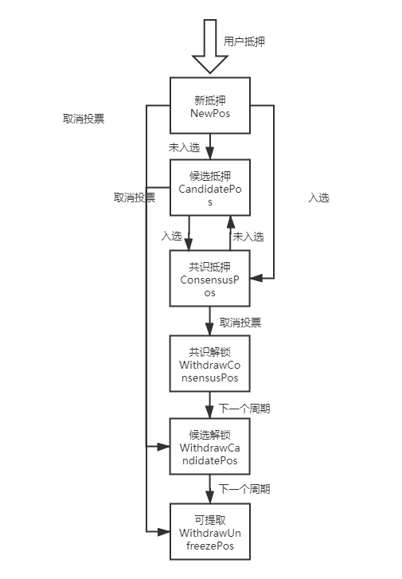

## 周期信息

```go
type GovernanceView struct {
	View   uint32
	Height uint32
	TxHash common.Uint256
}
```

存储维护了当前周期，进入当前周期的区块高度和触发切换周期的交易hash。

## 节点信息

```go
type PeerPoolMap struct {
	PeerPoolMap map[string]*PeerPoolItem
}
type PeerPoolItem struct {
	Index      uint32         //peer index
	PeerPubkey string         //peer pubkey
	Address    common.Address //peer owner
	Status     Status         //peer status
	InitPos    uint64         //peer initPos
	TotalPos   uint64         //total authorize pos this peer received
}
```

上述结构体维护了节点信息，该节点信息每个周期都会有一份，当前周期的节点信息处于不断变化中，切换周期后，之前周期的信息处于快照状态。合约一共只维护两个周期的节点信息，多余的将会删除。

## 用户投票和资产解锁信息

```go
type AuthorizeInfo struct {
	PeerPubkey           string
	Address              common.Address
	ConsensusPos         uint64 //pos deposit in consensus node
	CandidatePos         uint64 //pos deposit in candidate node
	NewPos               uint64 //deposit new pos to consensus or candidate node, it will be calculated in next epoch, you can withdrawal it at any time
	WithdrawConsensusPos uint64 //unAuthorized pos from consensus pos, frozen until next next epoch
	WithdrawCandidatePos uint64 //unAuthorized pos from candidate pos, frozen until next epoch
	WithdrawUnfreezePos  uint64 //unfrozen pos, can withdraw at any time
}
```

上述结构体维护了用户的投票和资产解锁信息，该信息全局一份，不随周期进行快照，随时处于变化之中。每次周期切换其中的状态也会随之切换，具体状态切换如图所示：



## 用户在治理合约中的总资产信息

```go
type TotalStake struct { //table record each address's total stake in this contract
	Address    common.Address
	Stake      uint64
	TimeOffset uint32
}
```

记录用户在治理合约中的总资产，用户出入金安全和解绑ong的结算。

## 惩罚的资产信息

```go
type PenaltyStake struct { //table record penalty stake of peer
	PeerPubkey   string //peer pubKey of penalty stake
	InitPos      uint64 //initPos penalty
	AuthorizePos uint64 //authorize pos penalty
	TimeOffset   uint32 //time used for calculate unbound ong
	Amount       uint64 //unbound ong that this penalty unbounded
}
```

记录拉黑节点惩罚的资产信息，包括节点质押的全部和用户质押的5%（可配置），该部分资产可由管理员取出。

## 节点属性信息

```go
type PeerAttributes struct {
	PeerPubkey   string
	MaxAuthorize uint64 //max authorzie pos this peer can receive(number of ont), set by peer owner
	T2PeerCost   uint64 //candidate or consensus node doesn't share initpos income percent with authorize users, 100 means node will take all incomes, it will take effect in view T + 2
	T1PeerCost   uint64 //candidate or consensus node doesn't share initpos income percent with authorize users, 100 means node will take all incomes, it will take effect in view T + 1
	TPeerCost    uint64 //candidate or consensus node doesn't share initpos income percent with authorize users, 100 means node will take all incomes, it will take effect in view T
	T2StakeCost  uint64 //candidate or consensus node doesn't share stake income percent with authorize users, it will take effect in view T + 2, 101 means 0, 0 means null
	T1StakeCost  uint64 //candidate or consensus node doesn't share stake income percent with authorize users, it will take effect in view T + 1, 101 means 0, 0 means null
	TStakeCost   uint64 //candidate or consensus node doesn't share stake income percent with authorize users, it will take effect in view T, 101 means 0, 0 means null
	Field4       []byte //reserved field
}
```

维护节点的最大接受投票数量，分润比例等信息。

## 治理合约配置

```go
type PreConfig struct {
	Configuration *Configuration
	SetView       uint32
}
type Configuration struct {
	N                    uint32
	C                    uint32
	K                    uint32
	L                    uint32
	BlockMsgDelay        uint32
	HashMsgDelay         uint32
	PeerHandshakeTimeout uint32
	MaxBlockChangeView   uint32
}
```

修改治理合约的配置，新的修改将在周期切换后生效。