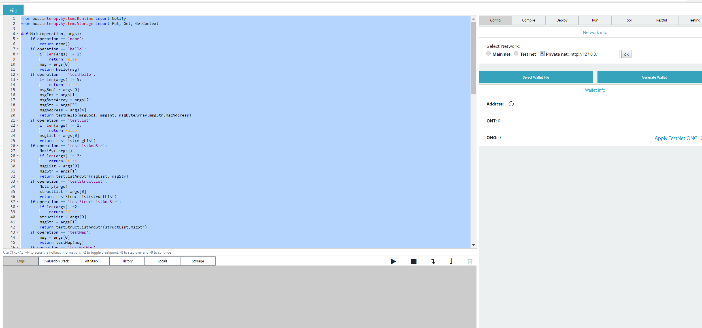

## NetworkSecurityGroup
* VM->SETTINGS->Networking->Inbound port rules
  * 80
  * 8080
  * 8085
  * 20334
  * 20335
  * 20336
  * 3306（Optional）

## Using(IP:External network IP of VM)
* smartx:http://IP:8080
 
* explorer:http://IP
 
 
## ONG acquisition mode ：
* ./ontology account list -v (View your wallet address,for example:ATcB3KHaC28dGgVPwU3DYUuXf5iBo1TLug)
* ./ontology asset transfer --from 1 --to 1 --asset=ont --amount=10000(Transfer your account to yourself)
* ./ontology asset unboundong 1(View the number of ong that can be transferred )
* ./ontology asset withdrawong 1(extract ong )
* ./ontology asset balance 1(Check the ong in your wallet. succeed)

## Software infomation
### 1.mysql
* port:3306
* user:root
* passwd:123456
* database:explorer
* operation :systemctl start/stop/restart mysqld

### 2.ontology
* path:/data/gopath/test
* operation:cd /data/gopath/test && ./start.sh
* Log:/data/gopath/test/Log
* wallet passwd:123456
* port:20334,20335,20336

### 3.httpd
* operation:systemctl start/stop/status/restart httpd
* port:80,8080,8000
  * smartx (/data/install/smartx) :8080
  * explorer  (/data/install/explorer_web):80

### 4.java service
* explorer service 
  * path: /data/install/explorer 
  * port:8085
  * description:Provide page logic API 
* sync servicde 
  * path: /data/install/ontsynhandler 
  * port:10010
  * description:Synchronization block chain information
